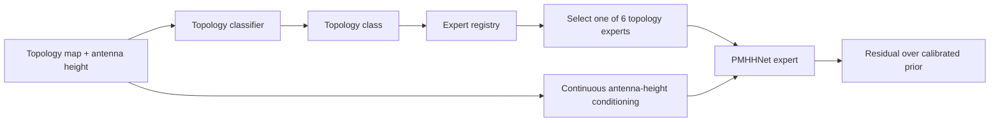

# Try 54

`Try 54` is the first branch that fully embraces a **partitioned expert**
strategy instead of a single universal regressor.

The core idea is:

- route each sample by **topology type** only;
- train one small specialist model per partition;
- keep the calibrated physical prior from `Try 47`;
- and introduce a new architecture, **PMHHNet**, so each topology specialist
  learns all antenna heights with explicit continuous height conditioning.

This branch is explicitly designed around the observation that:

- `LoS` is already relatively controlled by the prior;
- the hardest error is concentrated in `NLoS` and in heterogeneous city
  morphologies;
- and a single large model has not been using its capacity efficiently enough.

## What is new in Try 54

`Try 54` adds four linked ideas:

1. **Partitioned experts**
   - `6` topology classes
   - `1` expert per topology class
   - `6` specialist stage-1 models in total

2. **Automatic routing**
   - a small topology classifier predicts the topology class
   - antenna height is no longer used to choose an expert
   - topology class alone selects the expert

3. **PMHHNet**
   - our documented variant of `PMNet`
   - adds a lightweight high-frequency branch on top of the PMNet residual path
   - adds continuous height conditioning inside the feature hierarchy

4. **Height generalization inside each expert**
   - one expert sees low, mid, and high antenna cases together
   - height is modeled as a continuous conditioning signal, not a routing key

5. **Explicit `no_data` auxiliary prediction**
   - pixels without ray-tracing supervision are no longer only "ignored"
   - the regression loss still focuses on valid path-loss pixels
   - but an auxiliary head learns a `no_data` mask over the excluded regions

## Why this branch exists

The papers we reviewed do not suggest that the solution is to make one path
loss model arbitrarily large.

What they do suggest is:

- supervised regression with a strong prior;
- U-Net or PMNet-like medium backbones;
- transfer learning or warm starts when possible;
- explicit regime decomposition when the physics differ enough;
- and, increasingly, lightweight routing or context modules.

That is a much better match for:

- small experts,
- topology-aware routing,
- and continuous height conditioning

than for one single giant branch.

See:

- [PMNET_VS_PMHHNET.md](C:/TFG/TFGpractice/TFGFiftyFourthTry54/PMNET_VS_PMHHNET.md)
- [TRY54_TOPOLOGY_ROUTING_AND_CLASSIFIER.md](C:/TFG/TFGpractice/TFGFiftyFourthTry54/TRY54_TOPOLOGY_ROUTING_AND_CLASSIFIER.md)
- [Try 54 diagram page](C:/TFG/TFGpractice/diagram/try54/index.html)

## Topology classes

The current heuristic topology classes are:

- `open_sparse_lowrise`
- `open_sparse_vertical`
- `mixed_compact_lowrise`
- `mixed_compact_midrise`
- `dense_block_midrise`
- `dense_block_highrise`

They are inferred from topology-map statistics in:

- [data_utils.py](C:/TFG/TFGpractice/TFGFiftyFourthTry54/data_utils.py)

using thresholds over:

- non-ground density
- mean positive height

This is not meant to memorize city names. It is meant to group unseen cities by
urban morphology.

## Routing Supervision

The `Try 54` experts do **not** require the topology classifier to be trained
first.

Training supervision is split into two different pieces:

- physical supervision:
  - comes from the dataset `path_loss`
  - this is the real regression target used by the expert
- routing supervision:
  - comes from the deterministic topology partition heuristic
  - the topology class is derived directly from each sample's `topology_map`
  - this is pseudo-GT for the future classifier, not a separate human label

So the workflow is:

1. train the experts using heuristic topology partitions plus real path-loss GT
2. train the classifier later to imitate that same topology partitioning
3. use classifier -> registry -> expert at inference time

This means the experts are already being trained on the correct physical
targets even though the classifier itself has not been trained yet.

## Expert family

All six experts now share the same family:

Architecture:

- `PMHHNetResidualRegressor`

Current default config:

- `base_channels = 40`
- `hf_channels = 16`
- `out_channels = 2` (`residual` + `no_data logit`)
- `scalar_hidden_dim = 64`
- `encoder_blocks = [1, 2, 2, 2]`
- `context_dilations = [1, 2, 4, 8]`
- `use_scalar_film = true`
- `image_size = 513`
- `batch_size = 2`
- `gradient_checkpointing = false`
- formula prior cache enabled with a shared `prior_cache/try54_prior_auto_city_v1`
  during local generation, but on the UPC cluster the job now overrides it to
  a node-local temporary cache under `SLURM_TMPDIR`

Rationale:

- local blockers and shadow boundaries still matter;
- but splitting by antenna height makes the expert grid too fragmented;
- so the model now keeps one topology expert and learns height continuously;
- and the expert profile is intentionally lighter so the six specialists can be
  trained quickly.

## No-data handling

The current `Try 54` expert setup treats missing ray-tracing supervision in a
more explicit way than simply forcing a numeric placeholder like `180 dB`.

Current behavior:

- the path-loss regression term is still computed only where valid path-loss
  supervision exists;
- pixels that were previously masked out now contribute through an auxiliary
  `no_data` segmentation loss;
- if the HDF5 ever provides an explicit mask such as
  `data.path_loss_no_data_mask_column: path_loss_no_data_mask`, the auxiliary
  target is taken from that field directly;
- with the current dataset, that explicit field does not exist, so the code
  falls back to the topology-derived `non_ground_mask`;
- the model output therefore has:
  - channel `0`: residual over the calibrated prior
  - channel `1`: `no_data` logit

This keeps topology-related regions inside the total training objective without
pretending that "no ray-tracing data" is exactly the same thing as a measured
physical path-loss value.

## PMHHNet

Main implementation:

- [model_pmhhnet.py](C:/TFG/TFGpractice/TFGFiftyFourthTry54/model_pmhhnet.py)

`PMHHNet` is our own documented extension of `PMNet`.

It keeps the PMNet residual backbone and adds:

- a fixed Laplacian high-pass extraction over the input channels;
- a lightweight learned high-frequency projection branch;
- fusion of that branch into the PMNet head;
- FiLM-style modulation driven by the normalized antenna-height scalar.

The intention is not to replace PMNet. It is to create a regime-specific
variant for the partitions where the missing information looks more like:

- edge placement,
- obstruction boundaries,
- short-range spatial transitions,
- and height-dependent propagation behavior.

## Topology classifier

New files:

- [model_topology_classifier.py](C:/TFG/TFGpractice/TFGFiftyFourthTry54/model_topology_classifier.py)
- [train_topology_classifier.py](C:/TFG/TFGpractice/TFGFiftyFourthTry54/train_topology_classifier.py)

Current classifier variants:

- `TinyTopologyClassifier`

Purpose:

- predict one of the six topology classes from the topology map;
- then route to the correct expert family.

Current classifier config:

- [fiftyfourthtry54_topology_classifier.yaml](C:/TFG/TFGpractice/TFGFiftyFourthTry54/experiments/fiftyfourthtry54_topology_classifier/fiftyfourthtry54_topology_classifier.yaml)

## Expert config generation

Generated by:

- [generate_try54_configs.py](C:/TFG/TFGpractice/TFGFiftyFourthTry54/scripts/generate_try54_configs.py)

Outputs:

- `6` expert YAMLs in:
  - [fiftyfourthtry54_partitioned_stage1](C:/TFG/TFGpractice/TFGFiftyFourthTry54/experiments/fiftyfourthtry54_partitioned_stage1)
- expert registry:
  - [fiftyfourthtry54_expert_registry.yaml](C:/TFG/TFGpractice/TFGFiftyFourthTry54/experiments/fiftyfourthtry54_partitioned_stage1/fiftyfourthtry54_expert_registry.yaml)

The registry records:

- topology class
- config path
- expected checkpoint path

## Data partitioning

The dataset split builder now supports filtering by partition before the split.

That means an expert config can say:

- train only `dense_block_highrise`
- across **all antenna heights**

and the loader will restrict sample refs to exactly that topology partition before
building train/val/test.

This logic lives in:

- [data_utils.py](C:/TFG/TFGpractice/TFGFiftyFourthTry54/data_utils.py)

## Current pipeline sketch

## Active prior

The prior remains:

- [regime_obstruction_train_only_from_try47.json](C:/TFG/TFGpractice/TFGFiftyFourthTry54/prior_calibration/regime_obstruction_train_only_from_try47.json)

This branch is not replacing the prior. It is replacing the single-regressor
idea on top of that prior.

## Status

Implemented:

- partition-aware split/filtering
- topology classifier model and trainer
- `PMHHNet`
- generated `6` expert YAMLs
- expert registry generation
- inference-time model construction support for `pmhhnet`

Still intentionally lightweight or pending:

- a single fully integrated routed inference launcher that chains:
  - classifier -> expert -> prediction
- cluster scripts specific to the new expert grid
- systematic benchmark of which topology classes benefit most from `PMHHNet`

## Validation JSON

The `Try 54` expert validation files are now designed to be readable without
extra notebook work.

Useful top-level blocks:

- `path_loss`
  - overall physical metrics for the expert prediction
- `path_loss__prior__overall`
  - the calibrated prior on the same validation pixels
- `improvement_vs_prior`
  - absolute and relative RMSE/MAE gain over the prior
- `no_data`
  - auxiliary segmentation metrics for the `no_data` head
- `experiment`
  - compact summary of:
    - topology class
    - architecture
    - widths
    - image size
    - batch size
    - sample count
    - resolved `no_data` target source actually used at runtime
- `_support`
  - valid-pixel counts and fractions
- `_selection`
  - metric name, current score, and whether the epoch is the current best
- `_train`
  - train losses, learning rate, timing, and throughput
- `_checkpoint`
  - current epoch, best epoch, and best score

The more detailed per-regime debugging metrics are still available under
`_regimes`.

## Training speed

The current expert setup is optimized primarily through the data pipeline:

- small `PMHHNet` experts (`base_channels = 40`, `hf_channels = 16`)
- `image_size = 385`
- `batch_size = 2` on `2 GPU`
- formula-prior cache enabled
- precompute of the prior cache before each expert starts training on the
  cluster
- `prefetch_factor` enabled for both train and validation loaders

In practice, the main startup bottleneck was not the network itself but the
on-the-fly physical prior. The queued experts now warm that cache first so the
following epochs should start and run more smoothly.

This does **not** create a new heavyweight HDF5 for the prior cache. The
cluster path uses temporary per-job `.pt` cache files instead.

Low-risk speed ideas still available if we need more:

- use non-blocking host-to-device transfers if batch unpacking becomes a copy
  bottleneck
- benchmark whether `num_workers = 6` or `8` helps more than `4` on
  `sert-2001`
- add optional `validate_every = N` if validation starts dominating wall time

## Related docs

- [PMNET_VS_PMHHNET.md](C:/TFG/TFGpractice/TFGFiftyFourthTry54/PMNET_VS_PMHHNET.md)
- [TRY54_IMPLEMENTATION_NOTES.md](C:/TFG/TFGpractice/TFGFiftyFourthTry54/TRY54_IMPLEMENTATION_NOTES.md)
- [Try 54 diagram page](C:/TFG/TFGpractice/diagram/try54/index.html)
- [PATH_LOSS_MODEL_TRAINING_PAPERS.md](C:/TFG/TFGpractice/PATH_LOSS_MODEL_TRAINING_PAPERS.md)
