ELSEVIER

Contents lists available at ScienceDirect

## Pattern Recognition

journal homepage: www.elsevier.com/locate/patcog

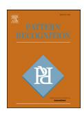

# SAR-to-optical image translation based on improved CGAN

Xi Yanga, Jingyi Zhaoa, Ziyu Weia, Nannan Wanga, Xinbo Gaob,c,\*

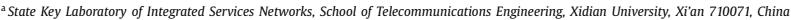

- b State Key Laboratory of Integrated Services Networks, School of Electronic Engineering, Xidian University, Xi'an 710071, China
- cThe Chongqing Key Laboratory of Image Cognition, Chongqing University of Posts and Telecommunications, Chongqing 400065, China

### ARTICLE INFO

Article history: Received 26 February 2021 Revised 16 June 2021 Accepted 27 July 2021 Available online 2 August 2021

Keywords: SAR-to-optical image translation Chromatic aberration loss ICGAN

#### ARSTRACT

SAR images have the advantages of being less susceptible to clouds and light, while optical images conform to the human vision system. Both of them are widely applied in the field of scene classification, natural environment monitoring, disaster warning, etc. However, due to the speckle noise caused by the SAR imaging principle, it is difficult for people to distinguish the ground objects from complex background without professional knowledge. One commonly used solution is to exploit Generative Adversarial Networks (GAN) to translate SAR images to optical images which is able to clearly present ground objects with rich color information, i.e., SAR-to-optical image translation. Traditional GAN-based translation methods are apt to cause blurring of contour, disappearance of texture and inconsistency of color. To this end, we propose an improved conditional GAN (ICGAN) method. Compared with the basic CGAN model, the translation ability of our method is improved in the following three aspects. (1) Contour sharpness. We utilize the parallel branches to combine low-level and high-level features. and thus the image contour information is improved without the influence of noise. (2) Texture finegrainedness. We discriminate the image using multi-scale receptive fields to enrich the local and global texture features of the image. (3) Color fidelity. We use the chromatic aberration loss which is based on Gaussian blur convolution to reduce the color gap between the generated image and the real optical image. Our method considers both the visual layer and the conceptual layer of the image to complete the SAR-to-optical image translation task. The model is able to preserve the contours and textures of the SAR image, while more closely approximates the colors of the ground truth. The experimental results show that the generated image not only has preferable results in visual effects and favorable evaluation metrics (subjective and objective), but also achieves outstanding classification accuracy, which proves the superiority of our method over the state-of-the-arts in the SAR-to-optical image translation task.

© 2021 Elsevier Ltd. All rights reserved.

### 1. Introduction

SAR images are high-resolution radar images with a certain surface penetration capability, which are capable of transmitting ground information all the time. However, the single channel information and speckle noise affect the visual effect and sence classification accuracy of SAR image. At present, optical satellite is also an important way of earth observation, and optical images contain rich color information to facilitate accurate scenes classification. Thus, if we translate SAR images to optical images, it is eas-

E-mail addresses: xbgao@mail.xidian.edu.cn, gaoxb@cqupt.edu.cn (X. Gao).

ier to recognize the ground information and categorize different scenes for people who have not learned professional knowledge. Therefore, it is of great significance to explore the method of SARto-optical image translation.

Many traditional methods color the SAR image[1,2] to complete the translation, but it can only achieve the effect of separating the ground object, and cannot restore the real ground truth. Due to the outstanding performance of GAN [3] in deep learning, more and more translation tasks use GAN as a basic model [4–8] in recent years. However, it cannot generate the result artificially. CGAN [9] is proposed to effectively limit the generated images by adding conditional constraints, which allows the training process of the model to proceed in the desired direction. Nowadays, many methods use basic CGAN to complete the SAR-to-optical image translation task [10–12]. Whereas, the task is very difficult because the translation model needs to extract the image information and keep

\* Corresponding author at: State Key Laboratory of Integrated Services Networks, School of Electronic Engineering, Xidian University, Xi'an 710071, China and Chongqing Key Laboratory of Image Cognition, Chongqing University of Posts and Telecommunications, Chongqing 400065, China

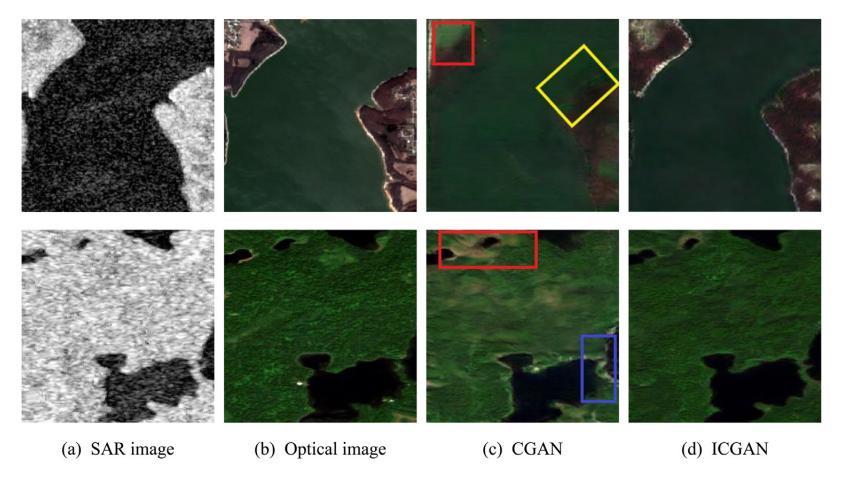

**Fig. 1.** Examples of SAR-to-optical image translation based on different methods. (a) SAR images of Sentinel-1. (b) Optical images of Sentinel-2. (c) Generated images of CGAN. (d) Generated images of ICGAN.

it as much as possible under strong interference, such as inevitable speckle noise. Most of them have problems with blurred contours, loss of textures, and color distortion.

Examples of generated images using CGAN are given in Fig. 1. We find that the contour of the image in the yellow rectangle is very blurred and even the contour is not visible at all. The blue rectangle shows unrealistic edge information and image textures. The two red rectangles reflect the color distortion. For example, the first row of image does not display the color information of the corresponding area and the second row of image appeares redundant colors. Correspondingly, for three problems mentioned above, we propose an improved CGAN (ICGAN) method for SAR-to-optical image translation. The major contributions of our method are as follows:

- 1) We propose parallel feature fusion generator to improve the contour sharpness. Taking into account the similar features (the same ground information) and different features (the unique speckle noise) between optical images and SAR images, the generator removes the redundant speckle noise and completes the texture with color information, then gets better generated image. The contour module filters out the great mass of speckle noise, and thus extracts more contour features and generates clearer edge, which makes it easier to distinguish different targets.
- 2) We utilize multi-scale discriminator to improve the texture fine-grainedness. Different receptive fields are used to distinguish the result of different sizes features, which is helpful to learn global and local features, thereby enriching the low-level texture information of generated images.
- 3) We use the chromatic aberration loss to improve the color fidelity. It relies on Gaussian blur convolution to highlight the color information, so as to better constrain color distortion of generated images.

The improved CGAN method (ICGAN) conducts alternate training based on the principle of maximum-minimum game and incorporates feature information from both SAR and optical images. The generated images not only retain the contour and texture of SAR images, but also restore the color of ground truth to the maximum extent. Our method integrates the visual layer and the conceptual layer of images which not only achieves good visual effect, but also improves the accuracy of scene classification.

## **2. Related work**

## *2.1. Generative adversarial networks*

As the development of deep learning techniques, Generative Adversarial Networks (GAN) [\[3\]](#page-7-0) plays an important role in many computer vision fields such as semantic segmentation [\[4\],](#page-7-0) image super-resolution [\[5\],](#page-7-0) style transfer [\[6–8\],](#page-7-0) text-to-image synthesis [\[13\],](#page-7-0) image retrieval [\[14,15\],](#page-7-0) image compression [\[16\]](#page-7-0) and image registration [\[17\].](#page-7-0)

The basic idea of GAN is to utilize the principle of maximumminimum game to continuously optimize the generator and discriminator until they achieve Nash equilibrium, so that the generated image and the real image are getting closer and closer in distribution. The generator generates synthetic data from the given noise of uniform or normal distribution, and the discriminator distinguishs the output of generator from the real data. The generator tries to get closer to the real data, while the discriminator tries to distinguish the real data from the generated data more perfectly. However, GAN is an unsupervised network, the generated result cannot be controlled and has a relatively narrow application range. For this reason, conditional Generative Adversarial Networks (CGAN) [\[9\]](#page-7-0) is proposed, which adds additional conditions as lables, limiting the types of generated images. The loss function of CGAN is defined as:

$$\min_{G} \max_{D} \mathcal{L}_{cGANs}(G, D) = E[\log(D(y, x))] + E[\log(1 - D(y, G(x)))], \tag{1}$$

where *x* is the real data. *y* is the conditional information and *G*(*x*) is the output data of the generator. *D*(*y*, *x*) represents the real input data into the discriminator, and *D*(*y*, *G*(*x*)) represents the fake input data into the discriminator.

Pix2Pix [\[18\]](#page-7-0) is a supervised CGAN model that inputs pairs of data as conditional constraints. It takes U-net as the network structure of the generator and patchGAN as the discriminator and the validity of it is verified on many datasets. However, there are still many unpaired datasets that cannot be used for image translation. Therefore, CycleGAN [\[19\]](#page-7-0) is proposed for the unsupervised image translation task, which uses cycle-consistency loss to constrain the generated image. Recently, NiceGAN [\[20\]](#page-7-0) has been proposed as a new unsupervised CGAN model that achieves well results by reusing the image encoding process.

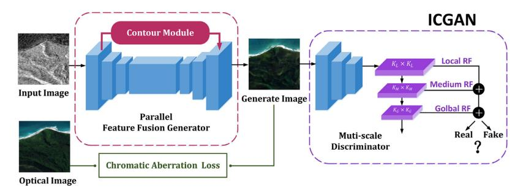

**Fig. 2.** The network architecture of ICGAN. It mainly improves three parts, including parallel feature fusion generator, multi-scale discriminator and chromatic aberration loss. RF stands for receptive field.

## *2.2. Interpretation of SAR image based on CGANs*

The interpretation of SAR images has always been a hot research topic in the field of remote sensing. Numerous methods have been proposed to adjust SAR images more suitable for visual recognition [\[21–23\],](#page-7-0) which are mainly divided into image improvement algorithms and colorization algorithms. The image improvement algorithms reduce part of the speckle effect, so that the SAR images [\[24–28\]](#page-7-0) show the ground objects more clearly. The colorization algorithms [\[1,2,29\]](#page-7-0) do not consider the geometrical figures in the transformation image space, and only encode the pixels of different colors to interpret the SAR image.

The SEN1-2 dataset [\[30\]](#page-7-0) is published by Schmitt et al. for promoting the deep learning research of the fusion of SAR images and optical images, which performs pixel-level comparison and regression to color SAR images. Merkle et al. [\[31\]](#page-7-0) firstly show that the Pix2Pix-based method can translate SAR images into grayscale optical images in a preselected area.

Recently, an increasing number of researches on SAR-to-optical image translation based on GAN model occur [\[10–12\]](#page-7-0) because of GAN's advantages in image-to-image translation. They usually add different loss functions to constrain the image generation process, but do not balance the network structure of GANs, so most of the previous works still exist many problems. For example, the contours of the generated images are blurred, the texture information of generated images is missing and the color information of generated images is different from ground truth. All of these lead to the weakness of SAR image interpretating task. Thus, we propose an improved version of CGAN for SAR-to-optical image traslation to ease these problems.

## **3. Proposed method**

As shown in Fig. 2, we propose an ICGAN method for translating SAR to optical image. In our model, we improve the contour, texture and color of generated image in different ways. On one hand, we adopt parallel feature fusion generator to improve the sharpness of contour, which can extract contour features and filter noise. On the other hand, multi-scale discriminator is used to improve the fine-grainedness of texture and unify the whole and local generation effect. In addition, we use chromatic aberration loss to improve the fidelity of color, so that the generated image is closer to the real optical image.

## *3.1. Parallel feature fusion generator*

The imaging principle of SAR images create inevitable speckle noise, which affects the visual effect of images and the extraction of other high frequency information features. To this end, we extract the high and low frequency information separately in the generator using parallel branches, and finally fuse them. The structure of our generator is shown in [Fig.](#page-3-0) 3.

The upper branch of the contour module adopts the convolution kernel with smaller size, which is used to restrain the speckle noise without destroying other high-frequency features. The lower branch mainly consists of down-sampling, residual blocks and upsampling. Convolution kernels of different sizes are used to extract features in different ranges. The size of the convolution kernel is composed of 7 × 7 and 3 × 3. The small-size convolution kernel is used to extract image texture information, while the large-size convolution kernel is used to extract image semantic features. The padding layers adopt a mirror filling method because it obtains more edge information of the original image and causes less artifact phenomenon than zero filling. The lower branch keeps the low-frequency information unchanged in order to generate images similar to SAR images as far as possible. Finally, the two branches fuse features to generate image with sharp contour information.

[Fig.](#page-3-0) 4 shows the effect of adding the contour module to the generator on the feature maps at different layers with the same input. The first row shows the feature maps without the contour module. (a), (b) and (c) represent the feature maps extracted at layer 18, layer 21 and layer 24, respectively. The second row is the feature maps with the contour module. To ensure fairness, the same number of layers are extracted for the three feature maps (d), (e) and (f) as the first row. We find that more contour features are extracted in the same layer and the overall edge is clearer by adding the contour module. This proves that our parallel feature fusion generator has an improved effect on the contour sharpness of images.

## *3.2. Multi-scale discriminator*

The multi-scale approach has been proved to be effective in many tasks and different scale of receptive fields result in different generated image effects [\[18,20\].](#page-7-0) To synthesize the overall image effect, we leverage the multi-scale receptive field in discriminator to distinguish the true and false. We divide the discriminator into an encoder and three small classifiers of different scales based on prior conclusions. The three small classifiers are localscale, medium-scale and global-scale receptive field, respectively. The loss function of multi-scale discriminator is defined as:

$$\mathcal{L}_{D_{j=Real,Fake}} = \sum_{i=L,M,G} ((\|K_i - j_i\|_2^2)/3), \tag{2}$$

where *DReal*, *DFake* represent the true discriminant result and the false discriminant result, respectively. *KL*, *KM* and *KG* represent the local-scale, the medium-scale and the global-scale receptive field, respectively. *jL*, *jM*, *jG* represent three different sizes of all zero matrices, respectively.

**Fig. 3.** The architecture of our generator, which mainly adopts the method of parallel feature fusion for texture improvement.

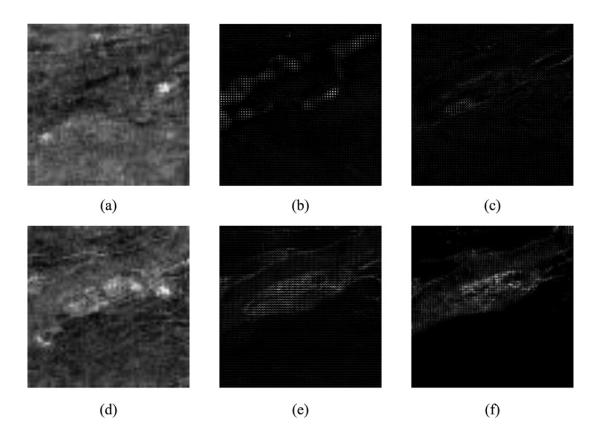

**Fig. 4.** Example of feature maps output from the generator. (a), (b) and (c) are feature maps of different convolutional layers without the parallel branch. (d), (e) and (f) are feature maps of different convolutional layers with the parallel branch.

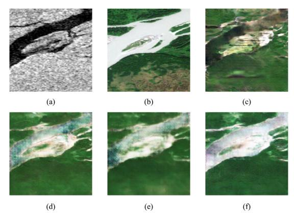

**Fig. 5.** Examples of different scale receptive fields (RF) in discriminator. (a) SAR image. (b) Optical image. (c) Medium RF. (d) Local + Medium RF. (e) Medium + Global RF. (f) Local + Medium + Global RF.

The generated images by using different scale receptive fields are shown in Fig. 5. Most of GAN models apply medium-scale because it perceive lines, such as Pix2Pix in (c). However, we discover that it is not sensitive to color information, so we add local-scale receptive field in baseline. From (d), we find that it is able to produce a local clear effect but cannot take care of the entire image. Global-scale receptive field can consider global information, so we try to add it in baseline. However, we get blurred contours which result in poor image quality in (e). To combine the advantages of three different scales, we add local, medium and global scale receptive fields into the discriminator and obtain the final generated image by enhancing the fine-grainedness of the texture.

We apply multi-scale discriminator to encode and classify images to predict whether the input image is true or false. It considers both global and local information, which makes the image more unified as a whole. The texture of the generated image is improved at different scales by our discriminatory approach.

## *3.3. Chromatic aberration loss*

The *L*1 loss and *GAN* loss are applied in Pix2Pix [\[18\].](#page-7-0) They guarantee the details and structure information of the generated image. We utilize the chromatic aberration loss based on Gaussian fuzzy convolution, which is mentioned in the image improvement task [\[32\].](#page-8-0) Chromatic aberration loss improves the color information of the generated image. Because blur is able to weaken highfrequency information such as textures and perceive color information better, we use Gaussian fuzzy convolution to generate blurred images. MSE is used to measure the distance between the blurred generated image and the blurred real optical image. We add the chromatic aberration loss to reduce the color gap between the generated image and the target image, so as to restore the true color of the surface as much as possible. The definition of chromatic aberration loss is given:

$$\mathcal{L}_{CA}(G(x), y) = \|(G(x))_b - y_b\|_2^2, \tag{3}$$

$$y_b(i, j) = \sum_{k,l} y(i + k, j + l) \cdot G_B(k, l),$$
 (4)

where *G*(*x*)*b* and *yb* are the blurred images of generate image *G*(*x*) and real optical image *y*, respectively. The 2D Gaussian blur operator is given by:

$$G_B(k,l) = A \exp(-\frac{(k - \mu_{G(x)})^2}{2\sigma_{G(x)}} - \frac{(l - \mu_y)^2}{2\sigma_y}),$$
 (5)

we define A = 0.053, μ*G*(*x*),*y* = 0, and σ*G*(*x*),*y* = 3. In summary, the total loss of ICGAN is defined as:

$$\mathcal{L}_{total} = \mathcal{L}_{cGAN}(G, D) + \lambda_1 \cdot \mathcal{L}_{L1} + \lambda_2 \cdot \mathcal{L}_{color}, \tag{6}$$

where λ1 and λ2 denote the weight of the L*L*1 and the L*color*, respectively.

## **4. Experiment**

## *4.1. Dataset*

The dataset comes from the SAR-optical remote sensing image dataset provided by Schmitt et al. [\[30\],](#page-7-0) i.e., SEN1-2 dataset. It is taken by Sentinel-1 and Sentinel-2. The Sentinel-1 consists of two polar orbiting satellites, equipped with C-band SAR sensors, which enables them to acquire imagery regardless of the weather. The Sentinel-2 comprises twin polar orbiting satellites in the same orbit and is meant to provide continuity for multi-spectral image

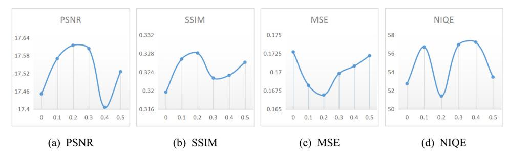

Fig. 6. Change of evaluation metrics with the value of  $\lambda_2$ . We determine  $\lambda_2$  by selecting the optimal values of the four metrics.

## **Table 1**The information of images involved in the Image Translation and Image Classification Datasets. Values in the parentheses represent the specific number of images in each category.

| Tasks | Image translation and scene classification |
|-------|--------------------------------------------|
| Train | mountain(910), island(672), desert(867),   |
|       | forest(574), prairie(1190), river(677),    |
|       | farmland(1070), vegetation(667),           |
|       | highland(968), other(958), residence(1447) |
| Test  | mountain(286), island(205), desert(271),   |
|       | forest(179), prairie(373), river(203),     |
|       | farmland(277), vegetation(208),            |
|       | highland(310), other(270), residence(418)  |

data. The SEN1-2 dataset contains pairs of SAR-Optical images covering different regions and four seasons of the world. The optical images come from Sentinel-2 and select only bands 4, 3, and 2 to create RGB images, and the SAR images come from Sentinel-1 and only use data from the VV channel in the SEN1-2 dataset.

We randomly sample the dataset for translation task and classification task from the SEN1-2 dataset. 10,000 pairs of SAR-Optical images are used in the training process, and 3000 pairs of SAR-optical images are used as test data. According to the naming rules and the morphological differences of the data in SEN1-2 dataset, our dataset can be divided into 10 categories. The detailed dataset is presented in Table 1.

## 4.2. Evaluation metrics

Firstly, we employ common image quality evaluation metrics to assess the images generated by different methods. PSNR, SSIM and MSE are objective evaluation, which are mainly the results of averaging the pixel difference value of the image. To better match the human visual effect, we use a subjective evaluation metric, i.e., NIQE [33], which is a non-reference image evaluation metric. It measures the difference in the multivariate distribution of image, and this distribution is constructed by features extracted from a series of normal natural images. The value of NIQE is inversely proportional to the degree of similarity between the measured image and the natural image.

Secondly, we adopt accuracy to assess the classification effect of images generated by different methods. Accuracy is the percentage of the results that our model predicts correctly, and its value is proportional to the classification effect.

## 4.3. Implement details

We make all improvements based on Pix2Pix [18]. In addition, to verify that the generated images can assist SAR image interpretation, We apply VGG19 and Resnet50 models to do classification experiments, both of which are pre-trained on ImageNet. We

compare with several state-of-the-arts methods in the translation task and the classification task. All methods are conducted with the public codes and our dataset for training and testing under the same experimental environment for fair comparison.

We do experiments on the computer with a single GTX TITAN with 12 GB GPU memory and on PyTorch framework. The size of inputs and outputs of the generator are set to  $256 \times 256 \times 3$ . We take 3 symmetrical down-sampling layers and 3 up-sampling layers in the generator and add 9 residual blocks with internal element addition. For the receptive fields of different size in the discriminator, we take  $10 \times 10$  as the local size,  $70 \times 70$  as the medium size and  $286 \times 286$  as the global size, respectively. Adam optimizer is utilized to optimize the network, in which parameters  $\beta_1$  and  $\beta_2$  are set to 0.5 and 0.999 respectively. 200 epochs are trained to ensure model convergence. Learning rate stays at a fixed value of 0.0002 for the first 100 epochs, and then linearly decreases to 0 in the remaining epochs. According to Pix2pix [18] and other GANs [19,20], we set the weight of L1 to 100, i.e.,  $\lambda_1 = 100$ .

Chromatic aberration loss plays an important role in the adjustment of color gap in our model. Thus, we do a weight experiment on  $\lambda_2$  to get the most effective weight value for the network, which is shown in Fig. 6. The weight of the color loss is too large while the image will be blurred, so we limit the value of  $\lambda_2$  between 0 and 0.5. Fig. 6 shows that PSNR, SSIM, MSE and NIQE all achieve their best when  $\lambda_2$  is equal to 0.2. Thus, we set  $\lambda_2$  to 0.2 in the training process.

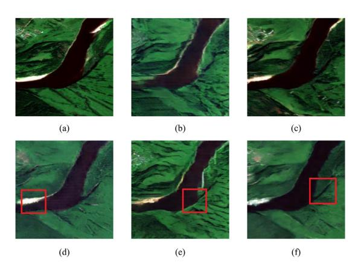

Fig. 7. Examples of visualization results of ablation experiments. (a) Real optical image. (b) Baseline. (c) Baseline + Parallel G. (d) Baseline + Muti-Scale D. (e) Baseline + CA Loss. (f) ICGAN.

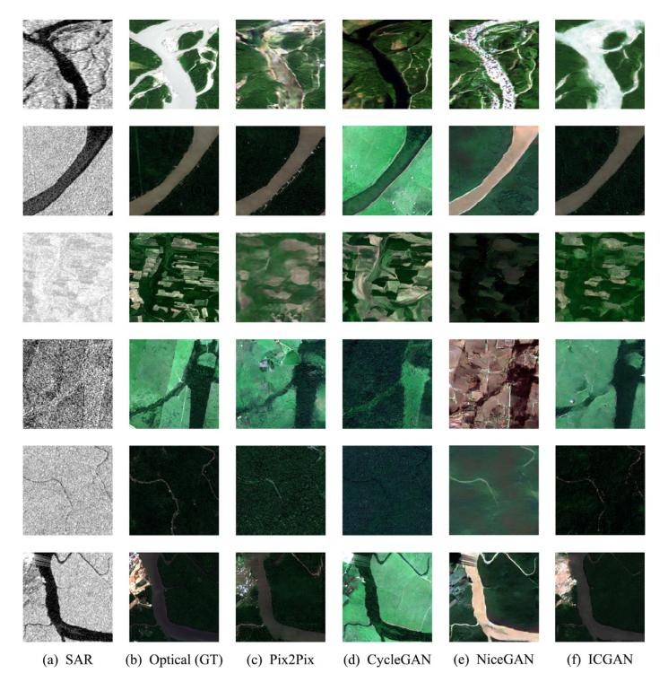

Fig. 8. Examples of SAR-to-optical image translation. The images from left to right are (a) SAR images. (b) Optical images (GT). (c) Pix2Pix. (d) CycleGAN. (e) NiceGAN. (f) ICGAN.

 Table 2

 Performance with different components of translation on SEN1-2 dataset.

| Components   |              |         | Evaluation metrics |        |        |         |             |
|--------------|--------------|---------|--------------------|--------|--------|---------|-------------|
| Parallel G   | Muti-scale D | CA Loss | PSNR               | SSIM   | MSE    | NIQE    | Accuracy(%) |
| ×            | ×            | ×       | 17.4515            | 0.3197 | 0.1727 | 52.8758 | 91.77       |
| $\checkmark$ | ×            | ×       | 17.8843            | 0.3416 | 0.1592 | 51.8431 | 95.30       |
| ×            | √            | ×       | 18.7917            | 0.3890 | 0.1303 | 47.5898 | 96.73       |
| ×            | ×            | √       | 17.6151            | 0.3281 | 0.1669 | 51.4001 | 97.10       |
| $\checkmark$ | √            |         | 18.8111            | 0.3959 | 0.1296 | 46.6666 | 97.73       |

## 4.4. Ablation study

We conduct ablation experiments on the SEN1-2 dataset to verify the effectiveness of our three improvements. The visualization results and evaluation metric results are shown in Fig. 7 and Table 2, respectively. Fig. 7(a) is a real optical image and Fig. 7(b) is generated by Pix2Pix.

The red box part in Fig. 7(c) shows the improvement effect in the contour information. The generated image better restores the structure of the real optical image and does not occur blur contour. From the red box part in Fig. 7(d), we find that the texture information of the image has been improved after adding the multiscale discriminator. Compared with the baseline, it not only generates the edge of the river, but also supplements the surrounding white areas. The red box part in Fig. 7(e) is brown-red, but this area is black in real optical image. The added chromatic aberration loss corrects the color information, so the area in Fig. 7(d) is displayed in black. From the perspective of the overall effect of the generated image in Fig. 7(f), our method is better than baseline in terms of contour sharpness, texture fine-grainedness, and color fidelity.

All of our evaluation metrics is improved in Table 2, which proves that the three improvements are all effective in both objective and subjective evaluation metrics. Among them, the objective metric SSIM and the subjective metric NIQE have the most significant optimization effect. We use the pre-trained VGG19 model for scene classification and find that every part of ICGAN improves relative to the baseline, which proves the significance of our method for subsequent applications.

## 4.5. Comparison with state-of-the-arts

The visualization results and evaluation metrics of ICGAN are shown in Fig. 8 and Table 3, respectively. In addition, Fig. 9 and Table 4 show the results of scene classification, respectively. Compared with other methods, our translation model integrates the visual layer and the conceptual layer of images, and considers the feature information of each part in an all-round way. It not only retains the details contained in the SAR images and restores the true color of the ground truth, but also is more accurate than SAR images in scene classification tasks.

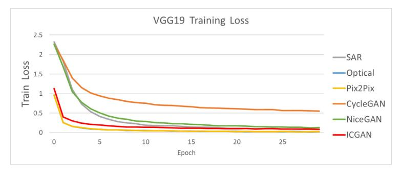

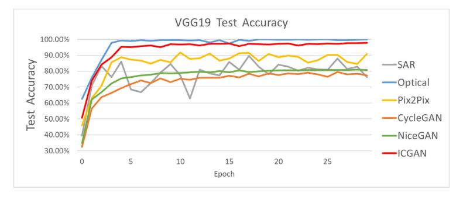

**Fig. 9.** Loss function and accuracy curves of classification experiments using VGG19 models. (a) Loss function curve of the training sets. (b) Accuracy curve of the test sets.

**Table 3** Performance with different methods of translation on SEN1- 2 dataset.

| Method   | PSNR    | SSIM   | MSE    | NIQE    |
|----------|---------|--------|--------|---------|
| Pix2Pix  | 17.4515 | 0.3197 | 0.1726 | 52.8758 |
| CycleGAN | 12.5944 | 0.1755 | 0.5480 | 56.6317 |
| NiceGAN  | 11.6042 | 0.1873 | 0.6098 | 52.6020 |
| ICGAN    | 18.8111 | 0.3959 | 0.1296 | 46.6666 |
|          |         |        |        |         |

**Table 4** Performance with different Images of classification.

|          | The best classification accuracy(%) |          |  |  |
|----------|-------------------------------------|----------|--|--|
| Images   | VGG19                               | RESNET50 |  |  |
| SAR      | 89.67                               | 94.30    |  |  |
| Pix2Pix  | 91.77                               | 95.53    |  |  |
| CycleGAN | 79.43                               | 74.47    |  |  |
| NiceGAN  | 80.90                               | 79.50    |  |  |
| ICGAN    | 97.73                               | 97.97    |  |  |

## *4.5.1. Visualization comparison*

According to what we mentioned in Introduction, the gray scale of SAR image is related to the degree of change of the ground object.

The first and second rows of images in [Fig.](#page-5-0) 8 are taken at the junction of lake and land. Because the target object varies greatly, the SAR image contains a large gray scale. Through comparison, we find that our method is significantly better than other methods in contour information. For example, the white river in the first row is well restored, and the generated image in the second row is almost as clear as the original image without noise. This proves that

our method has a certain improvement ability in contour definition.

Observing the third and fourth rows of the images in [Fig.](#page-5-0) 8, we find that our method improves the texture part while ensuring the color accuracy, which greatly improves the topography and texture characteristics of the image. Even in the SAR images with small gray scale and insignificant changes, our method recovers the texture information. Numerous block areas in the third row and a small light green area in the upper right corner of the fourth row are restored and reflected in the generated image.

The chromatic aberration loss is used to adjust the chromatic aberration between the images. From the fifth and sixth lines of the images in [Fig.](#page-5-0) 8, the generated image by our method has the smallest color gap with the optical image.

From the overall visualization results, compared with several other image conversion methods, the image generated by our method is closest to the real image. The result not only exhibits more realistic colors, but also generates clearer outlines and richer textures.

## *4.5.2. Metrics comparison*

Our method has a significant improvement in PSNR compared with the unsupervised method, because the image generated by the supervised image translation method contains less noise. Regarding the value of the commonly used SSIM for image quality evaluation, our method obviously surpasses the other methods, which shows that our method is closer to real optical images in terms of contrast and brightness. The value of MSE obtained by the supervised method is much lower than that of the unsupervised method. And our method is the lowest, which means that the difference between the generated image and the real optical image is smallest in pixel. Also, NIQE is the lowest compared with

other methods. In particular, several other methods have NIQE values above 50 and our method reduces them to below 50, which proves that the generated images are not only closer to the natural image, but also suitable for the human visual system.

#### *4.5.3. Classification comparison*

From [Fig.](#page-6-0) 9 and [Table](#page-6-0) 4, we find ICGAN are better than SAR in scenes classification. The training loss indicates that the convergence rate of SAR is lower than that of ICGAN. The test accuracy of ICGAN are higher and more stable than that of SAR. No matter in VGG19 or Resnet50, the best classification accuracy of generated images by ICGAN is higher than that of SAR images in [Table](#page-6-0) 4. We find that the accuracy of CycleGAN and NiceGAN is low, even lower than that of SAR. Referring to the visualization results, which may be due to the large color gap between generated images and optical images. The results of classification not only prove that it is meaningful to translate SAR image to optical image, but also prove that our method can obtain better effect than other translation methods.

#### **5. Conclusion**

In this paper, we study the practical application problem of translating SAR images to optical images to facilitate interpretation. We propose an improved model based on CGAN. On one hand, the sharpness of contour is improved. We use a parallel feature fusion generator to connect the low-level and high-level information. The generator filters out a lot of speckle noise to better extract feature information. On the other hand, the fine-grainedness of texture is improved. The multi-scale discriminator simultaneously considers the global and local information of the generated images, and the discriminant results are integrated as the final feedback. In addition, fidelity of color is improved. Chromatic aberration loss is used to narrow the gap between the generated images and the optical images to improve the visual effect. We not only achieve great effects on translation task and scene classification task, but also get favourable results in both subjective and objective evaluation metrics. Therefore, our method has achieved a relatively plummy degree of completion for SAR-to-optical image translation and it is of great significance for people to interpret SAR images more conveniently. We hope that others in this field pay more attention to the differences of multimodal data in SAR-to-optical translation task and improve the transformation capability by building the appropriate network. In the future, we need to focus on solving the problem of artifacts in the generated images, which will bring more development space for the SAR-to-optical translation task.

### **Declaration of Competing Interest**

The authors declare that they have no known competing financial interests or personal relationships that could have appeared to influence the work reported in this paper.

## **Acknowledgments**

This work was supported in part by the National Natural Science [Foundation](https://doi.org/10.13039/501100001809) of China under Grant nos. 61976166, 62036007, 61772402, 62050175, 61922066, and 61876142, in part by the Key Research and Development Program of Shaanxi under Grant 2021GY-030, in part by the Innovation Capacity Support Plan of Shaanxi Province under Grant 2020KJXX-027, in part by the Young Talent Fund of University Association for Science and Technology, Shaanxi, China, under Grant 20180104, in part by the [Fundamental](https://doi.org/10.13039/501100012226) Research Funds for the Central Universities under Grant JB210115, and in part by the Innovation Fund of Xidian University.

# **References**

- [1] [G.](http://refhub.elsevier.com/S0031-3203(21)00389-7/sbref0001) Ji, Z. [Wang,](http://refhub.elsevier.com/S0031-3203(21)00389-7/sbref0001) L. [Zhou,](http://refhub.elsevier.com/S0031-3203(21)00389-7/sbref0001) Y. [Xia,](http://refhub.elsevier.com/S0031-3203(21)00389-7/sbref0001) S. [Zhong,](http://refhub.elsevier.com/S0031-3203(21)00389-7/sbref0001) S. [Gong,](http://refhub.elsevier.com/S0031-3203(21)00389-7/sbref0001) SAR image colorization using multidomain [cycle-consistency](http://refhub.elsevier.com/S0031-3203(21)00389-7/sbref0001) generative adversarial network, IEEE Geosci. Remote Sens. Lett. 18 (2) (2021) 296–300.
- [2] F. [Ozcelik,](http://refhub.elsevier.com/S0031-3203(21)00389-7/sbref0002) U. [Alganci,](http://refhub.elsevier.com/S0031-3203(21)00389-7/sbref0002) E. [Sertel,](http://refhub.elsevier.com/S0031-3203(21)00389-7/sbref0002) G. [Unal,](http://refhub.elsevier.com/S0031-3203(21)00389-7/sbref0002) Rethinking CNN-based [pansharpening:](http://refhub.elsevier.com/S0031-3203(21)00389-7/sbref0002) guided colorization of panchromatic images via GANs, IEEE Trans. Geosci. Remote Sens. 59 (4) (2021) 3486–3501.
- [3] I.J. [Goodfellow,](http://refhub.elsevier.com/S0031-3203(21)00389-7/sbref0003) J. [Pouget-Abadie,](http://refhub.elsevier.com/S0031-3203(21)00389-7/sbref0003) M. [Mirza,](http://refhub.elsevier.com/S0031-3203(21)00389-7/sbref0003) B. [Xu,](http://refhub.elsevier.com/S0031-3203(21)00389-7/sbref0003) D. [Warde-Farley,](http://refhub.elsevier.com/S0031-3203(21)00389-7/sbref0003) S. [Ozair,](http://refhub.elsevier.com/S0031-3203(21)00389-7/sbref0003) A. [Courville,](http://refhub.elsevier.com/S0031-3203(21)00389-7/sbref0003) Y. [Bengio,](http://refhub.elsevier.com/S0031-3203(21)00389-7/sbref0003) Generative [adversarial](http://refhub.elsevier.com/S0031-3203(21)00389-7/sbref0003) networks, Adv. Neural Inf. Process. Syst. 27 (2014).
- [4] H. [Gammulle,](http://refhub.elsevier.com/S0031-3203(21)00389-7/sbref0004) S. [Denman,](http://refhub.elsevier.com/S0031-3203(21)00389-7/sbref0004) S. [Sridharan,](http://refhub.elsevier.com/S0031-3203(21)00389-7/sbref0004) C. [Fookes,](http://refhub.elsevier.com/S0031-3203(21)00389-7/sbref0004) Fine-grained action segmentation using the [semi-supervised](http://refhub.elsevier.com/S0031-3203(21)00389-7/sbref0004) action GAN, Pattern Recognit. 98 (2020) 107039.
- [5] Z. [Qian,](http://refhub.elsevier.com/S0031-3203(21)00389-7/sbref0005) K. [Huang,](http://refhub.elsevier.com/S0031-3203(21)00389-7/sbref0005) Q.-F. [Wang,](http://refhub.elsevier.com/S0031-3203(21)00389-7/sbref0005) J. [Xiao,](http://refhub.elsevier.com/S0031-3203(21)00389-7/sbref0005) R. [Zhang,](http://refhub.elsevier.com/S0031-3203(21)00389-7/sbref0005) Generative adversarial classifier for handwriting characters [super-resolution,](http://refhub.elsevier.com/S0031-3203(21)00389-7/sbref0005) Pattern Recognit. 107 (2020) 107453.
- [6] Y. [Fang,](http://refhub.elsevier.com/S0031-3203(21)00389-7/sbref0006) W. [Deng,](http://refhub.elsevier.com/S0031-3203(21)00389-7/sbref0006) J. [Du,](http://refhub.elsevier.com/S0031-3203(21)00389-7/sbref0006) J. [Hu,](http://refhub.elsevier.com/S0031-3203(21)00389-7/sbref0006) [Identity-aware](http://refhub.elsevier.com/S0031-3203(21)00389-7/sbref0006) CycleGAN for face photo-sketch synthesis and recognition, Pattern Recognit. 102 (2020) 107249.
- [7] D. [Li,](http://refhub.elsevier.com/S0031-3203(21)00389-7/sbref0007) C. [Du,](http://refhub.elsevier.com/S0031-3203(21)00389-7/sbref0007) H. [He,](http://refhub.elsevier.com/S0031-3203(21)00389-7/sbref0007) [Semi-supervised](http://refhub.elsevier.com/S0031-3203(21)00389-7/sbref0007) cross-modal image generation with generative adversarial networks, Pattern Recognit. 100 (2020) 107085.
- [8] W. [Xu,](http://refhub.elsevier.com/S0031-3203(21)00389-7/sbref0008) K. [Shawn,](http://refhub.elsevier.com/S0031-3203(21)00389-7/sbref0008) G. [Wang,](http://refhub.elsevier.com/S0031-3203(21)00389-7/sbref0008) Toward learning a unified [many-to-many](http://refhub.elsevier.com/S0031-3203(21)00389-7/sbref0008) mapping for diverse image translation, Pattern Recognit. 93 (2019) 570–580.
- [9] M. Mirza, S. Osindero, Conditional Generative Adversarial Nets, arXiv preprint [arXiv:1411.1784\(](http://arxiv.org/abs/1411.1784)2014).
- [10] H. [Toriya,](http://refhub.elsevier.com/S0031-3203(21)00389-7/sbref0010) A. [Dewan,](http://refhub.elsevier.com/S0031-3203(21)00389-7/sbref0010) I. [Kitahara, SAR2OPT:](http://refhub.elsevier.com/S0031-3203(21)00389-7/sbref0010) image alignment between multi- -modal images using generative adversarial networks, in: IEEE International Geoscience and Remote Sensing Symposium, 2019, pp. 923–926.
- [11] X. [Niu,](http://refhub.elsevier.com/S0031-3203(21)00389-7/sbref0011) D. [Yang,](http://refhub.elsevier.com/S0031-3203(21)00389-7/sbref0011) K. [Yang,](http://refhub.elsevier.com/S0031-3203(21)00389-7/sbref0011) H. [Pan,](http://refhub.elsevier.com/S0031-3203(21)00389-7/sbref0011) Y. [Dou,](http://refhub.elsevier.com/S0031-3203(21)00389-7/sbref0011) Image translation between high-resolution remote sensing optical and SAR data using conditional GAN, in: Pacific Rim Conference on [Multimedia,](http://refhub.elsevier.com/S0031-3203(21)00389-7/sbref0011) 2018, pp. 245–255.
- [12] K. [Enomoto,](http://refhub.elsevier.com/S0031-3203(21)00389-7/sbref0012) K. [Sakurada,](http://refhub.elsevier.com/S0031-3203(21)00389-7/sbref0012) W. [Wang,](http://refhub.elsevier.com/S0031-3203(21)00389-7/sbref0012) N. [Kawaguchi,](http://refhub.elsevier.com/S0031-3203(21)00389-7/sbref0012) M. [Matsuoka,](http://refhub.elsevier.com/S0031-3203(21)00389-7/sbref0012) R. [Nakamura,](http://refhub.elsevier.com/S0031-3203(21)00389-7/sbref0012) Image translation between SAR and optical imagery with generative adversarial nets, in: IEEE [International](http://refhub.elsevier.com/S0031-3203(21)00389-7/sbref0012) Geoscience and Remote Sensing Symposium, 2018, pp. 1752–1755.
- [13] L. [Gao,](http://refhub.elsevier.com/S0031-3203(21)00389-7/sbref0013) D. [Chen,](http://refhub.elsevier.com/S0031-3203(21)00389-7/sbref0013) Z. [Zhao,](http://refhub.elsevier.com/S0031-3203(21)00389-7/sbref0013) J. [Shao,](http://refhub.elsevier.com/S0031-3203(21)00389-7/sbref0013) H.T. [Shen,](http://refhub.elsevier.com/S0031-3203(21)00389-7/sbref0013) Lightweight dynamic conditional GAN with pyramid attention for [text-to-image](http://refhub.elsevier.com/S0031-3203(21)00389-7/sbref0013) synthesis, Pattern Recognit. 110 (2021) 107384.
- [14] S. [Zhao,](http://refhub.elsevier.com/S0031-3203(21)00389-7/sbref0014) J. [Li,](http://refhub.elsevier.com/S0031-3203(21)00389-7/sbref0014) J. [Wang,](http://refhub.elsevier.com/S0031-3203(21)00389-7/sbref0014) Disentangled [representation](http://refhub.elsevier.com/S0031-3203(21)00389-7/sbref0014) learning and residual GAN for age-invariant face verification, Pattern Recognit. 100 (2020) 107097.
- [15] R. [Yao,](http://refhub.elsevier.com/S0031-3203(21)00389-7/sbref0015) C. [Gao,](http://refhub.elsevier.com/S0031-3203(21)00389-7/sbref0015) S. [Xia,](http://refhub.elsevier.com/S0031-3203(21)00389-7/sbref0015) J. [Zhao,](http://refhub.elsevier.com/S0031-3203(21)00389-7/sbref0015) Y. [Zhou,](http://refhub.elsevier.com/S0031-3203(21)00389-7/sbref0015) F. [Hu,](http://refhub.elsevier.com/S0031-3203(21)00389-7/sbref0015) GAN-based person search via deep complementary classifier with [center-constrained](http://refhub.elsevier.com/S0031-3203(21)00389-7/sbref0015) triplet loss, Pattern Recognit. 104 (2020) 107350.
- [16] Y. [Sun,](http://refhub.elsevier.com/S0031-3203(21)00389-7/sbref0016) J. [Chen,](http://refhub.elsevier.com/S0031-3203(21)00389-7/sbref0016) Q. [Liu,](http://refhub.elsevier.com/S0031-3203(21)00389-7/sbref0016) G. [Liu,](http://refhub.elsevier.com/S0031-3203(21)00389-7/sbref0016) Learning image compressed sensing with sub-pixel [convolutional](http://refhub.elsevier.com/S0031-3203(21)00389-7/sbref0016) generative adversarial network, Pattern Recognit. 98 (2020) 107051.
- [17] D. [Mahapatra,](http://refhub.elsevier.com/S0031-3203(21)00389-7/sbref0017) Z. [Ge,](http://refhub.elsevier.com/S0031-3203(21)00389-7/sbref0017) Training data [independent](http://refhub.elsevier.com/S0031-3203(21)00389-7/sbref0017) image registration using generative adversarial networks and domain adaptation, Pattern Recognit. 100 (2020) 107109.
- [18] P. [Isola,](http://refhub.elsevier.com/S0031-3203(21)00389-7/sbref0018) J.-Y. [Zhu,](http://refhub.elsevier.com/S0031-3203(21)00389-7/sbref0018) T. [Zhou,](http://refhub.elsevier.com/S0031-3203(21)00389-7/sbref0018) A.A. [Efros,](http://refhub.elsevier.com/S0031-3203(21)00389-7/sbref0018) [Image-to-image](http://refhub.elsevier.com/S0031-3203(21)00389-7/sbref0018) translation with conditional adversarial networks, in: Proceedings of the IEEE Conference on Computer Vision and Pattern Recognition, 2017, pp. 1125–1134.
- [19] J.-Y. [Zhu,](http://refhub.elsevier.com/S0031-3203(21)00389-7/sbref0019) T. [Park,](http://refhub.elsevier.com/S0031-3203(21)00389-7/sbref0019) P. [Isola,](http://refhub.elsevier.com/S0031-3203(21)00389-7/sbref0019) A.A. [Efros,](http://refhub.elsevier.com/S0031-3203(21)00389-7/sbref0019) Unpaired image-to-image translation using [cycle-consistent](http://refhub.elsevier.com/S0031-3203(21)00389-7/sbref0019) adversarial networks, in: Proceedings of the IEEE International Conference on Computer Vision, 2017, pp. 2223–2232.
- [20] R. [Chen,](http://refhub.elsevier.com/S0031-3203(21)00389-7/sbref0020) W. [Huang,](http://refhub.elsevier.com/S0031-3203(21)00389-7/sbref0020) B. [Huang,](http://refhub.elsevier.com/S0031-3203(21)00389-7/sbref0020) F. [Sun,](http://refhub.elsevier.com/S0031-3203(21)00389-7/sbref0020) B. [Fang,](http://refhub.elsevier.com/S0031-3203(21)00389-7/sbref0020) Reusing discriminators for encoding: towards unsupervised [image-to-image](http://refhub.elsevier.com/S0031-3203(21)00389-7/sbref0020) translation, in: Proceedings of the IEEE Conference on Computer Vision and Pattern Recognition, 2020, pp. 8168–8177.
- [21] W. [Xie,](http://refhub.elsevier.com/S0031-3203(21)00389-7/sbref0021) J. [Lei,](http://refhub.elsevier.com/S0031-3203(21)00389-7/sbref0021) S. [Fang,](http://refhub.elsevier.com/S0031-3203(21)00389-7/sbref0021) Y. [Li,](http://refhub.elsevier.com/S0031-3203(21)00389-7/sbref0021) X. [Jia,](http://refhub.elsevier.com/S0031-3203(21)00389-7/sbref0021) [M.](http://refhub.elsevier.com/S0031-3203(21)00389-7/sbref0021) Li, Dual feature extraction network for [hyperspectral](http://refhub.elsevier.com/S0031-3203(21)00389-7/sbref0021) image analysis, Pattern Recognit. 118 (2021) 107992.
- [22] G. [Dong,](http://refhub.elsevier.com/S0031-3203(21)00389-7/sbref0022) H. [Liu,](http://refhub.elsevier.com/S0031-3203(21)00389-7/sbref0022) G. [Kuang,](http://refhub.elsevier.com/S0031-3203(21)00389-7/sbref0022) J. [Chanussot,](http://refhub.elsevier.com/S0031-3203(21)00389-7/sbref0022) Target recognition in SAR images via sparse [representation](http://refhub.elsevier.com/S0031-3203(21)00389-7/sbref0022) in the frequency domain, Pattern Recognit. 96 (2019) 106972.
- [23] Z. [Zhao,](http://refhub.elsevier.com/S0031-3203(21)00389-7/sbref0023) L. [Jiao,](http://refhub.elsevier.com/S0031-3203(21)00389-7/sbref0023) J. [Zhao,](http://refhub.elsevier.com/S0031-3203(21)00389-7/sbref0023) J. [Gu,](http://refhub.elsevier.com/S0031-3203(21)00389-7/sbref0023) J. [Zhao,](http://refhub.elsevier.com/S0031-3203(21)00389-7/sbref0023) Discriminant deep belief network for [high-resolution](http://refhub.elsevier.com/S0031-3203(21)00389-7/sbref0023) SAR image classification, Pattern Recognit. 61 (2017) 686–701.
- [24] W. [Xie,](http://refhub.elsevier.com/S0031-3203(21)00389-7/sbref0024) X. [Zhang,](http://refhub.elsevier.com/S0031-3203(21)00389-7/sbref0024) Y. [Li,](http://refhub.elsevier.com/S0031-3203(21)00389-7/sbref0024) J. [Lei,](http://refhub.elsevier.com/S0031-3203(21)00389-7/sbref0024) J. [Li,](http://refhub.elsevier.com/S0031-3203(21)00389-7/sbref0024) Q. [Du,](http://refhub.elsevier.com/S0031-3203(21)00389-7/sbref0024) Weakly supervised low-rank representation for [hyperspectral](http://refhub.elsevier.com/S0031-3203(21)00389-7/sbref0024) anomaly detection, IEEE Trans. Cybern. (2021) 1–12.
- [25] L. [Li,](http://refhub.elsevier.com/S0031-3203(21)00389-7/sbref0025) L. [Ma,](http://refhub.elsevier.com/S0031-3203(21)00389-7/sbref0025) L. [Jiao,](http://refhub.elsevier.com/S0031-3203(21)00389-7/sbref0025) F. [Liu,](http://refhub.elsevier.com/S0031-3203(21)00389-7/sbref0025) Q. [Sun,](http://refhub.elsevier.com/S0031-3203(21)00389-7/sbref0025) J. [Zhao,](http://refhub.elsevier.com/S0031-3203(21)00389-7/sbref0025) Complex [contourlet-cnn](http://refhub.elsevier.com/S0031-3203(21)00389-7/sbref0025) for polarimetric SAR image classification, Pattern Recognit. 100 (2020) 107110.
- [26] P.A. [Penna,](http://refhub.elsevier.com/S0031-3203(21)00389-7/sbref0026) N.D. [Mascarenhas,](http://refhub.elsevier.com/S0031-3203(21)00389-7/sbref0026) SAR speckle nonlocal filtering with statistical modeling of HAAR wavelet coefficients and stochastic distances, IEEE Trans. Geosci. Remote Sens. 57 (9) (2019) 7194–7208.
- [27] Y. [Sun,](http://refhub.elsevier.com/S0031-3203(21)00389-7/sbref0027) L. [Lei,](http://refhub.elsevier.com/S0031-3203(21)00389-7/sbref0027) D. [Guan,](http://refhub.elsevier.com/S0031-3203(21)00389-7/sbref0027) X. [Li,](http://refhub.elsevier.com/S0031-3203(21)00389-7/sbref0027) G. [Kuang,](http://refhub.elsevier.com/S0031-3203(21)00389-7/sbref0027) SAR image speckle reduction based on nonconvex hybrid total variation model, IEEE Trans. Geosci. Remote Sens. 59 (2) (2021) [1231.–1249.](http://refhub.elsevier.com/S0031-3203(21)00389-7/sbref0027)
- [28] S. [Liu,](http://refhub.elsevier.com/S0031-3203(21)00389-7/sbref0028) L. [Gao,](http://refhub.elsevier.com/S0031-3203(21)00389-7/sbref0028) Y. [Lei,](http://refhub.elsevier.com/S0031-3203(21)00389-7/sbref0028) M. [Wang,](http://refhub.elsevier.com/S0031-3203(21)00389-7/sbref0028) Q. [Hu,](http://refhub.elsevier.com/S0031-3203(21)00389-7/sbref0028) X. [Ma,](http://refhub.elsevier.com/S0031-3203(21)00389-7/sbref0028) Y.-D. [Zhang,](http://refhub.elsevier.com/S0031-3203(21)00389-7/sbref0028) SAR speckle removal using hybrid frequency [modulations,](http://refhub.elsevier.com/S0031-3203(21)00389-7/sbref0028) IEEE Trans. Geosci. Remote Sens. 59 (5) (2021) 3956–3966.
- [29] W. [Xie,](http://refhub.elsevier.com/S0031-3203(21)00389-7/sbref0029) J. [Lei,](http://refhub.elsevier.com/S0031-3203(21)00389-7/sbref0029) Y. [Cui,](http://refhub.elsevier.com/S0031-3203(21)00389-7/sbref0029) Y. [Li,](http://refhub.elsevier.com/S0031-3203(21)00389-7/sbref0029) Q. [Du,](http://refhub.elsevier.com/S0031-3203(21)00389-7/sbref0029) Hyperspectral [pansharpening](http://refhub.elsevier.com/S0031-3203(21)00389-7/sbref0029) with deep priors, IEEE Trans. Neural Netw. Learn. Syst. 31 (5) (2019) 1529–1543.
- [30] M. [Schmitt,](http://refhub.elsevier.com/S0031-3203(21)00389-7/sbref0030) L. [Hughes,](http://refhub.elsevier.com/S0031-3203(21)00389-7/sbref0030) X. [Zhu,](http://refhub.elsevier.com/S0031-3203(21)00389-7/sbref0030) The SEN1-2 dataset for deep learning in SAR-Optical data fusion, in: ISPRS Annals of [Photogrammetry,](http://refhub.elsevier.com/S0031-3203(21)00389-7/sbref0030) Remote Sensing and Spatial Information Sciences, 2018, pp. 141–146.

- [31] N. [Merkle,](http://refhub.elsevier.com/S0031-3203(21)00389-7/sbref0031) P. [Fischer,](http://refhub.elsevier.com/S0031-3203(21)00389-7/sbref0031) S. [Auer,](http://refhub.elsevier.com/S0031-3203(21)00389-7/sbref0031) R. [Müller,](http://refhub.elsevier.com/S0031-3203(21)00389-7/sbref0031) On the possibility of conditional adversarial networks for multi-sensor image matching, in: IEEE [International](http://refhub.elsevier.com/S0031-3203(21)00389-7/sbref0031) Geoscience and Remote Sensing Symposium, 2017, pp. 2633–2636.
- [32] A. [Ignatov,](http://refhub.elsevier.com/S0031-3203(21)00389-7/sbref0032) N. [Kobyshev,](http://refhub.elsevier.com/S0031-3203(21)00389-7/sbref0032) R. [Timofte,](http://refhub.elsevier.com/S0031-3203(21)00389-7/sbref0032) K. [Vanhoey,](http://refhub.elsevier.com/S0031-3203(21)00389-7/sbref0032) L. Van [Gool,](http://refhub.elsevier.com/S0031-3203(21)00389-7/sbref0032) DSLR-quality photos on mobile devices with deep [convolutional](http://refhub.elsevier.com/S0031-3203(21)00389-7/sbref0032) networks, in: Proceedings of the IEEE International Conference on Computer Vision, 2017, pp. 3277–3285.
- [33] A. [Mittal,](http://refhub.elsevier.com/S0031-3203(21)00389-7/sbref0033) R. [Soundararajan,](http://refhub.elsevier.com/S0031-3203(21)00389-7/sbref0033) A.C. [Bovik,](http://refhub.elsevier.com/S0031-3203(21)00389-7/sbref0033) Making a ǣcompletely blindǥ image quality analyzer, IEEE Signal Process. Lett. 20 (3) (2012) 209–212.

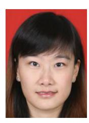

**Xi Yang** received the B.Eng. degree in electronic information engineering and the Ph.D. degree in pattern recognition and intelligence system from Xidian University, Xi'an, China, in 2010 and 2015, respectively. From 2013 to 2014, she was a visiting Ph.D. student with the Department of Computer Science, University of Texas at San Antonio, San Antonio, TX, USA. In 2015, she joined the State Key Laboratory of Integrated Services Networks, School of Telecommunications Engineering, Xidian University, where she is currently an associate professor in communications and information systems. Her current research interests include image/video processing, computer vision and multimedia information retrieval.

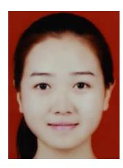

**Jingyi Zhao** received the B.E. degree in electronic information engineering from Lanzhou Jiaotong University, Lanzhou, China, in 2019. She is currently pursuing the M.S. degree with electronic and communication engineering from Xidian University, Xi'an, China. Her current research interests include deep learning, image processing and image translation.

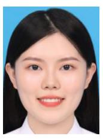

**Ziyu Wei** received the B.Eng. degree in electronic information engineering from Xi'an University of Architecture and Technology, Xi'an, China, in 2018. She is currently pursuing the Ph.D. degree in information and telecommunications engineering with the School of Telecommunications Engineering, Xidian University, Xi'an, China. Her current research interests include deep learning, image processing and computer vision.

**Nannan Wang** received the B.Sc. degree in information and computation science from the Xian University of Posts and Telecommunications in 2009 and the Ph.D. degree in information and telecommunications engineering from Xidian University in 2015. From September 2011 to September 2013, he was a Visiting Ph.D. Student with the University of Technology, Sydney, NSW, Australia. He is currently a Professor with the State Key Laboratory of Integrated Services Networks, Xidian University. He has published over 100 articles in refereed journals and proceedings, including IEEE T-PAMI, IJCV, NeurIPS etc. His current research interests include computer vision, pattern recognition, and machine learning.

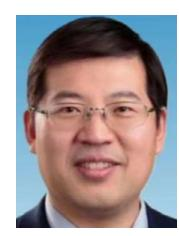

**Xinbo Gao** received the B.Eng., M.Sc. and Ph.D. degrees in electronic engineering, signal and information processing from Xidian University, Xi'an, China, in 1994, 1997, and 1999, respectively. From 1997 to 1998, he was a Research Fellow with the Department of Computer Science, Shizuoka University, Shizuoka, Japan. From 2000 to 2001, he was a Post-Doctoral Research Fellow with the Department of Information Engineering, the Chinese University of Hong Kong, Hong Kong. Since 2001, he has been with the School of Electronic Engineering, Xidian University. He is also a Cheung Kong Professor of the Ministry of Education of China, a Professor of Pattern Recognition and Intelligent System with Xidian University, and a Professor

of Computer Science and Technology with the Chongqing University of Posts and Telecommunications, Chongqing, China. He has published 6 books and around 300 technical articles in refereed journals and proceedings. His research interests include image processing, computer vision, multimedia analysis, machine learning, and pattern recognition. Prof. Gao is also a Fellow of the Institute of Engineering and Technology and the Chinese Institute of Electronics. He has served as the general chair/cochair, the program committee chair/co-chair, or a PC member for around 30 major international conferences. He is also on the Editorial Boards of several journals, including Signal Processing (Elsevier) and Neurocomputing (Elsevier).