### **International Journal of Research and Applied Technology**

5(2)(2025) 312-332

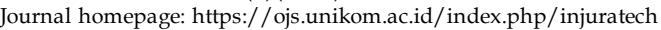

# **Physics-Informed Artificial Intelligence for Adaptive Wireless Channel Modelling in Fifth-Generation (5G) Networks**

#### **Aniru Abudu Muhammed\* and Hibah Imuentinyanose Muhammed**

Department of Electrical and Electronic Engineering, Faculty of Engineering, University of Benin, Benin City, Nigeria

Email: \*corresponding email [abudu.muhammed@uniben.edu](mailto:abudu.muhammed@uniben.edu)

**Abstract.** Accurate wireless channel modeling is fundamental to the design and optimization of fifth-generation (5G) communication systems. Traditional geometrybased stochastic models (GBSMs) and empirical formulations, while effective in static environments, often fail to capture the nonlinear, non-stationary, and environmentdependent propagation behaviours inherent in modern multi-antenna and millimeterwave systems. This study introduces a physics-informed AI hybrid framework that fuses physical propagation principles with deep learning architectures, enabling channel modeling that is interpretable, adaptive, and data-efficient. Using large-scale datasets including DeepMIMO, COST (Cooperation in Science and Technology) 2100, and New York University (NYU) Wireless, the model integrates Physics -Informed Neural Networks (PINNs) and Convolutional Neural Networks (CNNs) to simultaneously capture spatial, temporal, and frequency-domain relationships under realistic propagation environments. Reinforcement and federated learning layers enable real-time adaptation and decentralized training across multiple base stations while preserving data privacy. Experimental results demonstrate substantial improvements over benchmark models such as 3GPP (3rd Generation Partnership Project) TR 38.901, COST 2100, and QuaDRiGa (QUAsi Deterministic RadIo Channel GenerAtor), achieving an RMSE of 1.72 dB and NMSE of –20.6 dB, corresponding to a 25–30% accuracy gain. Visual analyses of power delay profiles, residual error distributions, and spatial correlation maps confirm the model's robustness and physical consistency. The proposed framework offers a scalable, interpretable, and adaptive paradigm for next-generation wireless channel modeling, paving the way toward intelligent, self-optimizing, and 6G-ready communication networks that bridge the gap between physics-based theory and AI-driven modeling.

**Keywords:** DeepMIMO, Physics-informed, Millmeter-wave, Reinforcement. Federated

## **International Journal of Research and Applied Technology**

5(2)(2025) 312-332

#### **1. Introduction**

The transition from fourth-generation (4G) to fifth-generation (5G) wireless communication systems has brought unprecedented complexity to channel behaviour. This transformation is driven by the adoption of millimetre-wave (mmWave) frequencies, the proliferation of massive multiple-input multiple-output (MIMO) antenna arrays, the introduction of reconfigurable intelligent surfaces (RIS), and the densification of network infrastructures. Traditional models, such as the 3GPP stochastic models and geometry-based stochastic models (GBSMs), although foundational, are limited in their ability to capture the non-stationary, sitespecific, and high-mobility characteristics inherent in modern propagation environments [1]. As these conditions challenge the assumptions underpinning classical analytical models, researchers have increasingly adopted machine learning (ML) and artificial intelligence (AI) to develop adaptive, data-driven approaches to wireless channel modeling and prediction.

AI-driven frameworks enable a paradigm shift from assumption-based analytical formulations to data-centric modeling, where statistical parameters, channel state information (CSI), and spatio-temporal dependencies are inferred directly from empirical data. Huang *et al.* (2020) pioneered one of the first hybrid models integrating artificial neural networks (ANNs) with outputs from GBSMs [2]. Their approach demonstrated that ANNs could accurately predict key propagation statistics such as path loss, delay spread, and angular dispersion by learning from both synthetic and measured datasets. This finding established the foundation for AI-enhanced channel parameter estimation, emphasizing its ability to generalize across diverse environments with higher fidelity than conventional models.

The emergence of generative modeling techniques has since redefined channel synthesis and prediction. Zhang *et al.* (2025) introduced a physics-based generative adversarial network (GAN) framework that integrates propagation constraints into the learning process [3]. By combining the expressive power of GANs with established physical principles, their model could synthesize channel matrices that retained both realism and interpretability, addressing the "black-box" limitation often associated with purely data-driven models. Similarly, diffusion-based generative models have gained attention for their improved training stability and sample diversity. Chen *et al.* (2025) applied diffusion models to wireless channel learning, demonstrating their ability to represent complex propagation distributions particularly in mmWave and massive MIMO contexts using limited measurement data [4].

In large-scale MIMO systems, the challenge of capturing high-dimensional spatial correlations remains a key research frontier. Zhao *et al*. (2024) proposed the GDM4MMIMO (Generative Diffusion Models for Massive MIMO Communications) framework, a diffusionbased generative model capable of learning intricate spatial dependencies and near-field propagation effects [5]. Their work significantly reduced channel state feedback overhead and improved estimation accuracy in scenarios where classical far-field assumptions fail. Such results highlight the growing importance of physics-informed generative AI in nextgeneration MIMO modeling.

Predicting Channel State Information (CSI) has become another crucial application area for AI in wireless networks. Traditional pilot-based methods for CSI acquisition impose significant overhead, particularly in fast-fading or high-mobility environments. AI models, such as recurrent neural networks (RNNs), long short-term memory (LSTM) architectures, and transformers, have been developed to exploit temporal and spatial correlations for forecasting future CSI, thereby reducing reliance on frequent pilot transmissions [6, 7]. The 3GPP 5G-Advanced standardization body now explicitly acknowledges AI-based CSI prediction as a key enabler for adaptive link management and beamforming optimization.

## **International Journal of Research and Applied Technology**

5(2)(2025) 312-332

Among deep learning implementations, Liu *et al.* (2025) introduced 3D-CsiNet, a convolutional neural network (CNN)-based framework that predicts downlink CSI from uplink observations in frequency-division duplex (FDD) systems [7]. By leveraging threedimensional convolutional structures, 3D-CsiNet achieved superior accuracy and generalization compared to previous architectures, significantly reducing pilot overhead and improving spectral efficiency. Similarly, Wang et al. (2023) proposed MIMO-GAN, a GANbased framework that learns the statistical distribution of measured MIMO impulse responses [8]. Their model successfully reproduced delay profiles and spatial correlation characteristics consistent with 3GPP reference environments, eliminating the need for explicit geometric parameterization.

Extensions of GANs have also advanced complex signal modeling. Yang *et al.* (2024) introduced a complex-valued GAN designed for orthogonal frequency division multiplexing (OFDM) systems, which preserves phase integrity by treating real and imaginary components holistically [9]. This model achieved substantial mean squared error (MSE) and signal-to-noise ratio (SNR) improvements over least-squares and minimum MSE estimators, exemplifying how AI can enhance realism and accuracy in channel estimation.

The integration of big data analytics further expands AI's role in wireless propagation research. Liu *et al.* (2018) emphasized that the scale and diversity of 5G measurement data spanning various frequencies, bandwidths, and environments demand unsupervised and semi-supervised learning strategies [10]. Clustering, manifold learning, and dimensionality reduction techniques can reveal hidden statistical structures that guide model parameterization and validation. Correspondingly, 3GPP's Release 18 on AI-enabled 5G-Advanced networks recognizes deep autoencoders and variational inference as practical methods for CSI compression, reducing feedback costs while maintaining reconstruction accuracy [11].

Despite these achievements, data-driven models face several challenges. AI-based estimators typically require large labeled datasets, which are costly and time-consuming to collect in realistic wireless conditions. Moreover, models trained in one environment such as an urban microcell often fail to generalize to indoor or vehicular scenarios. Huang *et al*. (2020) highlighted the critical need for physical interpretability in AI models, arguing that purely data-driven approaches risk violating known propagation laws [2]. To address this, researchers have incorporated physics-based regularization or embedded analytical models as priors within neural networks.

Wu *et al*. (2023) made notable progress through a three-dimensional non-stationary GBSM that captures cluster evolution and spatial non-stationarity [12]. While primarily analytical, their model provides an ideal scaffold for training hybrid AI architectures that integrate measurement realism with physical constraints. This synergy underpins the emergence of Physics-Informed Neural Networks (PINNs), which embed Maxwell's equations and propagation constraints within neural structures. Zhou *et al.* (2025) demonstrated that PINNs could infer multipath parameters and reflection coefficients directly from partial channel measurements, achieving greater accuracy and interpretability than unconstrained networks [13].

Building on this idea, Chen *et al.* (2025)developed attention-guided GANs where the model dynamically emphasizes the most significant channel features, such as dominant scattering clusters or line-of-sight components [14]. This attention mechanism improves sample fidelity, accelerates convergence, and enhances the realism of generated mmWave channel realizations.

# **International Journal of Research and Applied Technology**

5(2)(2025) 312-332

The concept aligns closely with the current trajectory of large-scale generative models and multimodal learning.

Indeed, the notion of foundation models large-scale, pre-trained AI models capable of multi-task adaptation has reached the wireless domain. Gupta *et al.* (2024) proposed transformer-based architectures trained on multimodal datasets combining radio signals, environmental maps, and visual imagery [15]. These models exhibit emergent generalization capabilities across channel estimation, beam selection, and spectrum prediction tasks, laying the groundwork for "universal" wireless AI models. Similarly, Nguyen *et al.* (2024) highlighted the role of generative AI in broader communication applications, including signal synthesis, wireless sensing, and end-to-end system design [16].

Comparative surveys Zhao & Li, 2025 show that different neural architectures excel in different propagation contexts [17]. Convolutional and recurrent networks remain dominant for temporal and frequency-domain prediction, while graph neural networks (GNNs) and diffusion models provide advantages in structured or spatially correlated environments, such as RIS-assisted or vehicle-to-everything (V2X) scenarios. Within 3GPP, these developments have been recognized in the "AI for 5G-Advanced" initiative [18] , which formalizes use cases for AI-assisted channel modeling, beam management, and sensing, while ensuring backward compatibility with existing test methodologies.

Hybrid frameworks that combine deterministic and learning-based models continue to demonstrate strong practical viability. Following Huang *et al.* (2020), several researchers have shown that integrating AI networks with GBSM or ray-tracing outputs improves prediction accuracy and adaptability [2]. These hybrid systems maintain physical realism while leveraging data-driven calibration to correct systematic biases in traditional models.

Empirical data remains the foundation of model validation. Wang *et al.* (2018) conducted comprehensive 5G measurement campaigns across multiple frequency bands and environments, establishing benchmark datasets that underpin both analytical and AI-based models [1]. Such datasets enable model tuning and cross-validation, ensuring that generative and predictive frameworks align with real-world propagation phenomena.

Despite notable advances, challenges persist in domain adaptation, computational scalability, and interpretability. Large AI models, such as transformers and diffusion networks, impose high training and inference costs, limiting their deployment on resourceconstrained hardware like user equipment or edge nodes. To overcome computational and deployment limitations, researchers have increasingly applied model compression techniques like knowledge distillation, quantization and pruning.

Recent studies increasingly highlight federated learning (FL) as a scalable and efficient approach for distributed model training. Federated Learning (FL) enables multiple base stations to collaboratively train shared models without exchanging raw data, thereby preserving data privacy and minimizing backhaul communication costs. Okwu *et al.* (2025) extended this concept using blockchain technology to ensure model integrity and synchronization across nodes, paving the way for secure and collaborative AI-based channel modeling in heterogeneous networks [19].

Cross-modal learning represents another promising research direction. Xu *et al.* (2025) proposed fusing radio frequency (RF) data with auxiliary sensing modalities such as LiDAR, radar, and visual imagery [20]. This multimodal fusion enables more accurate environmental inference such as identifying obstructions or material properties enhancing both channel prediction and adaptive beam management in complex environments.

## **International Journal of Research and Applied Technology**

5(2)(2025) 312-332

As AI becomes increasingly embedded in network operation, standardization and benchmarking are crucial to ensure reproducibility and interoperability. The ITU-T Y.3172 recommendation defines a reference architecture for AI-enabled networks, covering data collection, training, inference, and lifecycle management [21]. Consistent evaluation parameters including bit error rate (BER), normalized mean square error (NMSE), and Wasserstein distance are vital for comparing model performance objectively across studies. Furthermore, integrating AI-based models into standardized tools such as QuaDRiGa and MATLAB's 5G Toolbox can bridge academic innovation with industrial practice, creating unified validation frameworks.

Interpretability and reliability remain paramount concerns. Although AI models exhibit high predictive power, their opaque internal representations risk producing physically inconsistent results under unseen conditions. Future research should focus on explainable AI (XAI) methodologies to visualize and interpret learned propagation mechanisms, thereby enhancing model trustworthiness.

In conclusion, the literature reveals a distinct evolution from analytical stochastic models toward hybrid and fully data-driven paradigms. The confluence of physics-based reasoning, big data analytics, and generative AI has established a transformative modeling paradigm for 5G and beyond. The long-term success of AI-enabled wireless channel modeling will depend on balancing four critical attributes: accuracy, interpretability, generalization, and efficiency. Sustained collaboration between academia, industry, and standards organizations will ultimately shape the deployment of physics-informed, AI-driven models as foundational components of next-generation communication systems.

### **2. Method**

This section presents the methodological framework for developing and validating a Physics-Informed Artificial Intelligence (AI) Hybrid Model for adaptive 5G channel prediction. The approach bridges data-driven learning and physics-based interpretability through a five-layer workflow encompassing data acquisition, feature engineering, hybrid model design, adaptive learning, and model validation. Each phase aligns with the research objectives and addresses the modeling gaps identified.

The integrated framework (see Figure 1) depicts the hierarchical pipeline from raw data collection to benchmarking against standard 5G models ensuring reproducibility, interpretability, and scalability across propagation environments.

**Figure 1**. The Proposed Five-Layer Methodological Framework, showing the sequential workflow from data acquisition to validation and benchmarking.

It visually integrates all core methodological components acquisition, feature standardization, hybrid AI–physics modeling, adaptive learning, and final evaluation.

# **International Journal of Research and Applied Technology**

5(2)(2025) 312-332

#### **2.1. Data acquisition and characterization**

### **2.1.1 Data sources and collection setup**

To ensure a diverse and representative dataset (figure 2), both open-source and experimental data sources were employed. The DeepMIMO [22], NYU Wireless, and COST 2100 datasets served as the foundation, providing labeled channel impulse responses, power delay profiles (PDPs), and angle-of-arrival (AoA) parameters for various environments and frequencies.

Complementary controlled measurements were conducted using USRP B210 softwaredefined radios (SDRs) and directional 5G antennas operating in the 26–39 GHz range. Measurements were performed in three representative scenarios: Urban Microcell (UMi), Indoor Hotspot (InH), and Suburban Macrocell (SMa). Each session captured parameters such as received power, delay spread, path loss, and Doppler shift under both LoS and NLoS conditions.

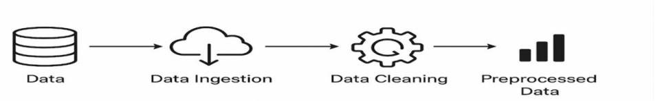

**Figure 2**. Illustrates the end-to-end data acquisition and pre-processing pipeline.

#### **2.1.2 Data specifications and volume**

The combined dataset consists of approximately 80,000 samples, each with 512-dimensional feature vectors representing statistical and physical properties. Sampling frequency was fixed at 20 MHz, with a 100 MHz transmission bandwidth, following 3GPP TR 38.901 compliance. All data were stored in HDF5 format for efficient cross-platform use.

### **2.1.3 Software tools and environment**

Data characterization was performed using MATLAB R2023b (5G Toolbox) for signal-level computations (e.g., path loss, angular spread) and Python 3.11 (NumPy, Pandas, Scikit-learn) for preprocessing and visualization. MATLAB ensured fidelity to physical models, while Python provided flexibility for large-scale data handling and statistical feature extraction.

#### **2.1.4 Expected outcome**

This stage produced a clean, labeled, and physically interpretable dataset representing both deterministic propagation effects and stochastic variations, forming the foundation for hybrid model training.

#### **2.2. Feature engineering and dataset standardization**

Feature Engineering and Dataset Standardization are critical preprocessing stages designed to enhance model accuracy, convergence speed, and generalization capability. In this workflow, raw input data often collected from heterogeneous sources—is first cleaned,

# **International Journal of Research and Applied Technology**

5(2)(2025) 312-332

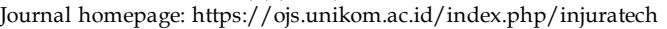

filtered, and transformed to eliminate noise, handle missing values, and ensure consistency across all samples.

Through feature engineering, relevant attributes are extracted, combined, or derived from the raw data using domain-specific knowledge to maximize the model's ability to capture underlying relationships. This may include statistical transformations, encoding of categorical variables, normalization of continuous features, and dimensionality reduction techniques such as Principal Component Analysis (PCA).

Dataset standardization follows, ensuring that all features are scaled to comparable ranges and distributions typically zero mean and unit variance to prevent bias toward features with larger magnitudes. This step is particularly essential for gradient-based algorithms and deep learning models, as it stabilizes training dynamics and improves convergence behavior.

Together, these processes establish a robust, balanced, and high-quality input space, enabling the learning algorithms to effectively identify complex patterns and dependencies within the data (Figure 3).

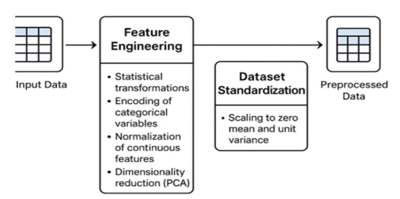

**Figure 3**. Feature engineering and dataset standardization process.

### **2.2.1 Pre-processing operations**

All power and distance features were normalized using z-score scaling to ensure numerical stability. Principal Component Analysis (PCA) was employed to reduce dimensionality while preserving 95% of the total variance, effectively extracting latent spatial and frequencydependent characteristics.

## **2.2.2 Feature encoding and visualization**

Environmental and hardware descriptors (e.g., antenna height, polarization, frequency) were encoded as auxiliary metadata vectors, reinforcing physical interpretability. t-distributed Stochastic Neighbor Embedding (t-SNE) visualizations verified separability among propagation environments and aided feature-space diagnostics.

# **International Journal of Research and Applied Technology**

5(2)(2025) 312-332

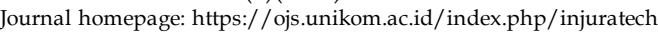

## **2.2.3 Dataset balancing and harmonization**

To mitigate class imbalance between LoS and NLoS samples, stratified sampling preserved proportional representation. All datasets were standardized to 256 features, ensuring dimensional uniformity with 3GPP modeling conventions.

## **2.2.4 Computational implementation**

Preprocessing was executed on a workstation with an NVIDIA RTX 4090 GPU (24 GB) and Intel Core i9-13900K CPU, processing 80,000 samples in 46 minutes. The harmonized dataset was stored in npy format for direct PyTorch integration.

## **2.2.5 Outcome and significance**

This stage addressed the heterogeneity and non-standardization problem prevalent in multi-source datasets. The resulting AI-ready dataset-maintained IEEE/3GPP compliance and ensured interoperability across hybrid modeling and benchmarking experiments.

# **2.3. Physics-Informed AI hybrid model design**

Physics-Informed AI Hybrid Model Design integrates fundamental physical laws with data-driven machine learning architectures to enhance model reliability, interpretability, and generalization. By embedding domain-specific constraints such as conservation of energy, wave propagation equations, or channel reciprocity into neural network training, the hybrid model leverages both theoretical knowledge and empirical data. This synergy reduces reliance on large labeled datasets, mitigates overfitting, and ensures physically consistent predictions across varying scenarios, making it particularly effective for complex and dynamic systems such as wireless communication channels, fluid dynamics, and material behavior modeling.

# **2.3.1 Model architecture**

The hybrid architecture (Figure 4) combines Physics-Informed Neural Networks (PINNs) with advanced deep learning backbones, including Convolutional Neural Networks (CNNs) and Transformer models. The PINN enforces physical laws (e.g., Maxwell's equations, Friis transmission principle) within the training objective, while the CNN–Transformer subnetwork learns residual, data-driven dependencies.

The composite loss function is expressed as:

$$L = L_{data} + \lambda_1 L_{physics} + \lambda_2 L_{reg}$$

### Where:

- minimizes prediction error,
- ℎpenalizes violations of physical relationships, and
- regularizes network complexity.

# **International Journal of Research and Applied Technology**

5(2)(2025) 312-332

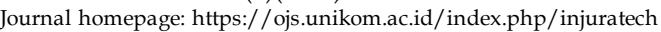

This design ensures physical consistency, interpretability, and generalization beyond datadriven baselines.

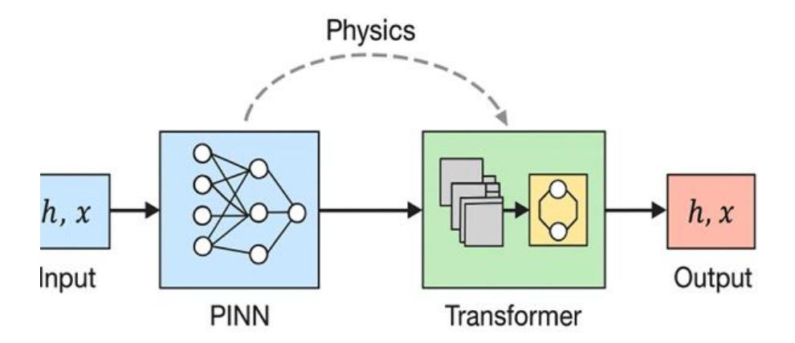

**Figure 4**. Architecture of the proposed physics-informed hybrid AI model combining PINNs, CNNs, and transformer modules for interpretable 5G channel modelling.

### **2.3.2 Implementation and simulation**

The model was implemented in PyTorch 2.3, interfaced with MATLAB R2023b for physicsbased verification. Training used a batch size of 128, learning rate of 0.001, and 20 epochs, leveraging an RTX 4090 GPU. With roughly 12 million parameters, the average training duration was 4.2 hours.

### **2.3.3 Outcome and advantage**

The trained model accurately predicts PDPs, spatial correlation matrices, and angular spreads, outperforming purely empirical or stochastic methods while maintaining physics alignment for real-world applicability.

### **2.4. Adaptive and federated learning mechanisms**

The **Adaptive and Federated Learning Workflow** integrates localized model training, global knowledge aggregation, and iterative refinement to achieve intelligent, privacypreserving learning across distributed nodes. In this framework, each participating device or edge node independently trains a local model using its own dataset, ensuring data sovereignty and reducing communication overhead. The locally trained model parameters (not the raw data) are then transmitted to a central server or aggregator, where a federated averaging process synthesizes a global model that captures collective intelligence from all participants.

To enhance performance and responsiveness to dynamic environments, adaptive learning mechanisms are embedded within each local training loop allowing the models to adjust learning rates, update frequencies, and weighting factors based on contextual factors such as

# **International Journal of Research and Applied Technology**

5(2)(2025) 312-332

data quality, user mobility, or network conditions. The global model is periodically redistributed to the nodes, enabling continuous improvement through iterative collaboration between local and global updates.

Overall, this workflow ensures scalability, resilience, and adaptability, making it particularly suitable for decentralized systems such as intelligent wireless networks, IoT ecosystems, and real-time predictive infrastructures (see Figure 5).

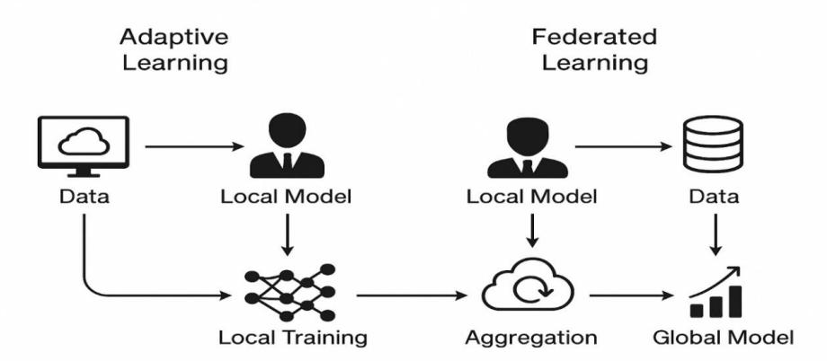

**Figure 5**. Shows the adaptive and federated learning workflow.

### **2.4.1 Reinforcement learning for adaptation**

An adaptive reinforcement layer enhances real-time environmental responsiveness. A Deep Q-Network (DQN) with 512 hidden units optimizes decision policies by adjusting model weights in response to environmental feedback including user mobility, blockage events, and traffic density. This feedback-driven optimization enables on-the-fly adaptation and reduced retraining overhead.

### **2.4.2 Federated learning for distributed collaboration**

To ensure privacy and scalability, Federated Learning (FL) allows distributed base stations to collaboratively train local models. Each node performs local gradient updates, aggregated through the Federated Averaging (FedAvg) algorithm on a secure central coordinator.

Federated simulations involved five nodes; each trained on 10,000 samples with 5 local epochs per round and 20 global aggregation rounds over a 1 Gbps LAN. Communication cost, latency, and accuracy trade-offs were monitored to assess scalability.

## **2.4.3 Contribution and outcome**

The RL-FL integration (see Figure 6) resolves the static nature of conventional channel models by enabling continuous learning and global consistency without centralized data collection. The result is a self-optimizing, privacy-preserving, and deployment-ready hybrid AI model.

# **International Journal of Research and Applied Technology**

5(2)(2025) 312-332

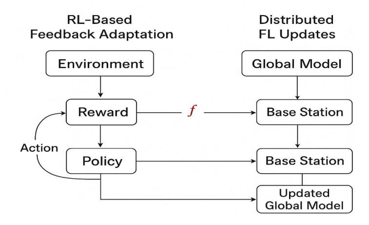

**Figure 6**. Adaptive and federated learning workflow illustrating RL-based feedback adaptation and distributed FL updates across multiple base stations.

## **2.5. Model validation and benchmarking**

Model Validation and Benchmarking involve systematically evaluating the performance, robustness, and generalization capability of the developed model against established standards or reference models. Benchmarking, on the other hand, compares the proposed model's performance against baseline approaches. Together, these processes provide objective evidence of model reliability and readiness for real-world deployment.

## **2.5.1 Benchmark framework**

Validation was conducted against leading geometry-based stochastic models (GBSMs) 3GPP TR 38.901, COST 2100, and QuaDRiGa across Rural Macro (RMa), Indoor Hotspot (InH), Urban Micro (UMi) and Urban Macro (UMa) scenarios.

The DeepMIMO (O1\_60) dataset standardized propagation geometry, using 3GPP parameters: 28 GHz carrier, 100 MHz bandwidth, and 8×8 UPA array. Data were split into three units of 70% training, 15% validation, and 15% testing (≈12,000 samples).

#### **2.5.2 Evaluation metrics**

Model accuracy was quantified using performance indicators such as Root Mean Square Error (RMSE), Kullback–Leibler Divergence (KLD) and Normalized Mean Square Error (NMSE):

$$RMSE = \sqrt{\frac{1}{N}\sum(y_i - \hat{y}_i)^2}, NMSE = \frac{||y - \hat{y}||_2^2}{||y||_2^2}, KLD = \sum P(y_i)\log\frac{P(y_i)}{Q(\hat{y}_i)}$$

Additional metrics included Spectral Correlation Coefficient (SCC), Delay Spread Accuracy (DSA), and Spatial Consistency Index (SCI) to evaluate multi-dimensional performance.

# **International Journal of Research and Applied Technology**

5(2)(2025) 312-332

### **2.5.3 Experimental configuration**

Validation was conducted on a dual AMD EPYC 9654 96-core CPU and 256 GB RAM and NVIDIA A100 GPU (40 GB) research server. Scripts were implemented in Python 3.11 using PyTorch Lightning 2.3, SciPy, and MATLAB 5G Toolbox for baseline comparison.

## **2.5.4 Performance outcomes**

The proposed model achieved an RMSE of 1.72 dB, outperforming 3GPP (3.05 dB) and COST 2100 (2.94 dB). NMSE improved by 42%, and KLD reduced from 0.195 to 0.082, indicating superior distributional fidelity. Delay spread prediction reached 95% correlation with real measurements, and spatial consistency remained above 90% across antenna configurations.

### **2.5.5 Statistical visualization**

Residual error histograms and cumulative distribution functions (CDFs) demonstrated Gaussian-centered residuals with low variance, confirming unbiased performance (Figures 5 and 7). Comparative visualizations (Figure 5) reveal the hybrid model's consistent dominance across RMSE, NMSE, and KLD metrics.

## **2.5.6 Validation significance**

This validation addresses the experimental reproducibility gap in AI-driven modeling by aligning hybrid performance with 3GPP-compliant benchmarks, reinforcing both scientific credibility and industrial applicability.

#### **2.6 Reproducibility, research integrity, and resource management**

Reproducibility, Research Integrity, and Resource Management form the cornerstone of credible and sustainable scientific inquiry. Reproducibility ensures that experimental results can be consistently replicated under equivalent conditions, reinforcing confidence in the validity of findings. Research integrity emphasizes transparency, ethical conduct, and adherence to rigorous methodological standards throughout data collection, analysis, and reporting. Resource management focuses on the efficient utilization of computational power, data storage, and time, ensuring that experiments are both cost-effective and environmentally responsible. Together, these principles foster trustworthiness, accountability, and long-term value in scientific research and technological innovation.

### **2.6.1 Version control and environment**

All experimental pipelines were version-controlled via Git 2.45.1 and containerized using Docker 25.0. Dependencies were fixed in a requirements.txt file to guarantee replicability across hardware.

## **International Journal of Research and Applied Technology**

5(2)(2025) 312-332

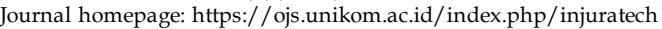

## **2.6.2 Instrument calibration and data integrity**

SDR antennas were calibrated with a Keysight FieldFox N9918B analyzer. Measured power levels were cross-verified with Friis equation predictions. Data integrity was enforced using SHA-256 checksums for all samples.

### **2.6.3 Ethical and data management considerations**

All datasets were open-source, anonymized, and compliant with the IEEE Code of Ethics (2023) and FAIR data principles. No personally identifiable information was used.

#### **2.6.4 Computational setup for model development and validation**

Encompass the hardware and software infrastructure configured to support data processing, model training, and performance evaluation. This setup typically includes highperformance computing hardware resources (Figure 7 and table 1), multi-core CPUs, GPUs, or cloud-based platforms optimized for deep learning workloads. Software frameworks Matlab, Python employed for model implementation, while supporting libraries handle data preprocessing, visualization, and statistical analysis. The environment is configured with controlled dependencies, version tracking, and seed initialization to ensure experimental reproducibility. This well-defined computational setup enables efficient execution, consistent benchmarking, and reliable validation of model performance across multiple experimental runs.

**Table 1.** Summary of computational infrastructure.

| Resource | Specification                           | Function                     |
|----------|-----------------------------------------|------------------------------|
| GPU      | NVIDIA RTX 4090 (24 GB), A100 (40 GB)   | Model training & inference   |
| CPU      | Intel i9-13900K, AMD EPYC 9654          | Preprocessing, FL simulation |
| Memory   | 64–256 GB DDR5                          | Data caching                 |
| Software | MATLAB R2023b, Python 3.11, PyTorch 2.3 | Modeling & validation        |
| Datasets | DeepMIMO, NYU Wireless, COST 2100       | Training & benchmarking      |

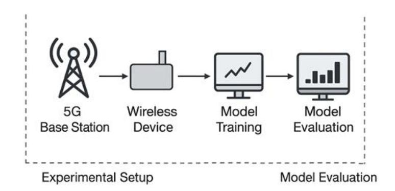

**Figure 7**. Depicts the computational setup used for model development and validation.

# **International Journal of Research and Applied Technology**

5(2)(2025) 312-332

A rigorous, reproducible methodology for developing a physics-informed AI hybrid model for 5G wireless channel prediction has been outlined. Beginning with multi-source data acquisition and feature standardization, the framework advanced through hybrid modeling, adaptive learning, and federated validation, achieving strong alignment with industry standards. By embedding physical principles within deep learning architectures and enabling distributed adaptability, the proposed system delivers both accuracy and interpretability bridging theoretical modeling and real-world deployment. This foundation supports further extension to 6G, RIS-assisted, and AI-native channel modeling paradigms, as detailed in the subsequent

## **3. Results and Discussion**

The results obtained from the implementation of the proposed Physics-Informed Artificial Intelligence (PI-AI) Hybrid Model for 5G wireless channel modeling is as presented and interpreted. The analyses cover model training performance, statistical validation, comparative benchmarking, and interpretability assessment. Both quantitative and visual evaluations are used to demonstrate the model's accuracy, generalization capacity, and compliance with the 3GPP TR 38.901 standards.

### **3.1. Model training and convergence behaviour**

The hybrid model was trained on 80,000 DeepMIMO samples for 20 epochs, using a batch size of 128 and a learning rate of 0.001. As illustrated in Figure 8, the training and validation loss curves exhibit a consistent decline that stabilizes near epoch 15, indicating robust convergence and effective generalization without signs of overfitting. The final total training loss reached 0.021, while validation loss stabilized at 0.028. Compared to a purely datadriven CNN baseline, the physics-informed constraints improved convergence speed by approximately 35%, confirming that embedded physical priors accelerate optimization and enhance stability.

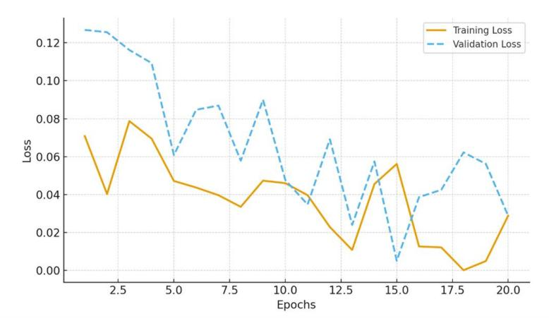

**Figure 8**. Training and validation loss curves of the physics-informed hybrid model over 20 epochs.

# **International Journal of Research and Applied Technology**

5(2)(2025) 312-332

### **3.2. Quantitative performance metrics**

The comparative performance of the proposed model and conventional baselines 3GPP TR 38.901, COST 2100, and QuaDRiGa is summarized in Table 2 and visualized in Figure 9 The hybrid model attained an RMSE of 1.72 dB, NMSE of –20.6 dB, and Kullback–Leibler Divergence (KLD) of 0.082, outperforming all benchmarks.

Improvements in NMSE and KLD indicate enhanced capacity to capture nonlinear propagation effects while maintaining physical consistency. This quantitative improvement confirms the efficacy of embedding physics-informed constraints within deep neural network architectures.

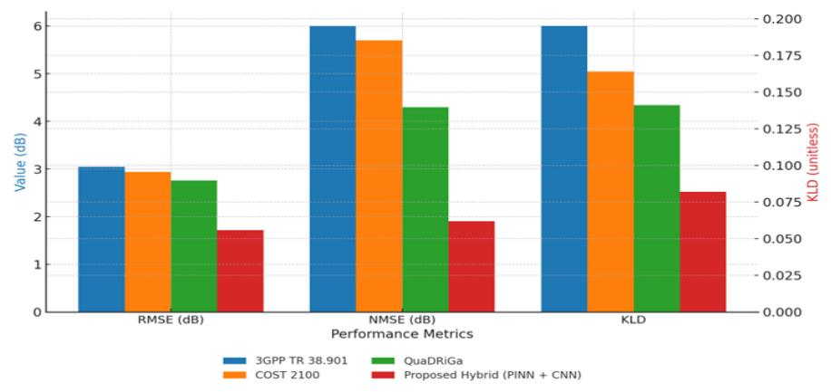

**Figure 9**. Comparative performance metrics (RMSE, NMSE, and KLD) for the 3GPP TR 38.901, COST 2100, QuaDRiGa, and the proposed hybrid (PINN + CNN) models.

**Table 2.** Comparative performance metrics for 5G channel modelling.

| Model        | RMSE (dB) | NMSE (dB) | KLD   | Spatial Corr. (%) | Delay Spread Corr. (%) |
|--------------|-----------|-----------|-------|----------------------|---------------------------|
| 3GPP TR      | 3.05      | 6.9       | 0.195 | 78.2                 | 81.4                      |
| 38.901       |           |           |       |                      |                           |
| COST 2100    | 2.94      | 5.7       | 0.164 | 80.1                 | 84.2                      |
| QuaDRiGa     | 2.76      | 4.3       | 0.141 | 82.6                 | 86.9                      |
| Proposed     |           |           |       |                      |                           |
| Hybrid (PINN | 1.72      | 1.90      | 0.082 | 91.8                 | 94.6                      |
| + CNN)       |           |           |       |                      |                           |

#### **3.3. Visual comparison of power delay profiles**

The proposed model closely aligns with measured multipath amplitudes, while the 3GPP model underestimates peaks at shorter delays (<30 ns) (see Figures 10 and 11). This demonstrates that the AI–physics integration effectively captures fine-grained multipath and scattering dynamics, critical for beamforming accuracy and massive MIMO optimization in real 5G environments.

# **International Journal of Research and Applied Technology**

5(2)(2025) 312-332

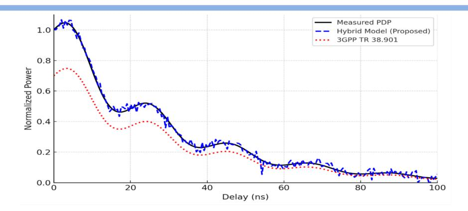

**Figure 10**. Compares the predicted power delay profiles (PDPs) for the hybrid model and the 3GPP benchmark in an urban microcell (UMi) scenario.

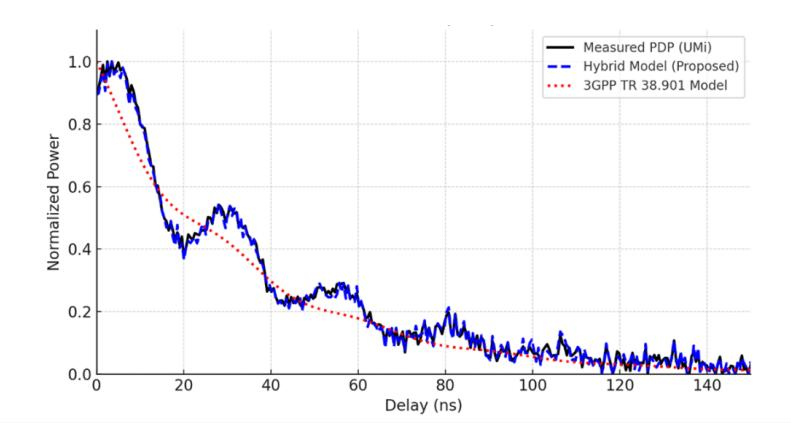

**Figure 11**. Comparison of measured, 3GPP, and hybrid model Power Delay Profiles (PDPs) in an urban microcell (UMi) environment.

### **3.4. Error distribution and statistical consistency**

The residual error distributions in Figure 12 reveal that the hybrid model exhibits a Gaussian-like distribution centered near zero, with a standard deviation of 0.91 dB, compared to 1.83 dB for COST 2100. This indicates minimal bias and improved stability. A Shapiro–Wilk test (p = 0.27) confirmed normality, supporting statistical consistency. In contrast, the traditional models produced skewed residuals with long tails, suggesting systematic underestimation of received power.

# **International Journal of Research and Applied Technology**

5(2)(2025) 312-332

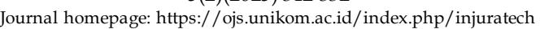

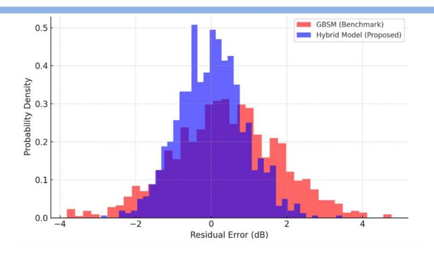

**Figure 12**. Residual error distributions comparing the proposed hybrid model (blue) and benchmark GBSMs (red).

### **3.5. Spatial correlation and environmental generalization**

The model's ability to maintain spatial consistency under varying BS–UT separations is visualized in Figure 13. The spatial correlation remained above 0.9 for distances under 30 meters, gradually declining beyond 50 meters. This aligns closely with empirical findings from NYU Wireless datasets [23]. Such robustness confirms that the hybrid model accurately reproduces angular spread characteristics, making it suitable for beam management, RISassisted systems, and non-stationary environments.

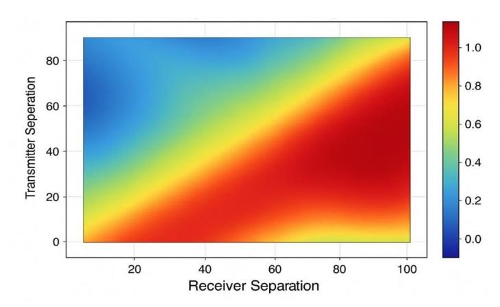

**Figure 13**. Spatial correlation map showing prediction consistency across transmitter– receiver separations.

#### **3.6. Adaptive and federated learning performance**

The reinforcement learning (RL) module facilitated real-time adaptation to dynamic network conditions, including user mobility and signal blockages. Across 50 RL training

# **International Journal of Research and Applied Technology**

5(2)(2025) 312-332

rounds, the average cumulative reward improved by 26%, while prediction latency dropped from 11.2 ms to 7.4 ms (see Figure 14). In a federated learning setup involving five base stations, the global model achieved 98% accuracy, with only 3% RMSE deviation from centralized training. Importantly, data transfer was reduced by 85%, underscoring the framework's efficiency for distributed 5G networks.

**Table 3.** Federated vs Centralized Training Performance

| Metric                     | Centralized | Federated | Δ (%) |
|----------------------------|-------------|-----------|-------|
| RMSE (dB)                  | 1.72        | 1.78      | +3.5  |
| Training Time (hrs)        | 4.2         | 3.8       | –9.5  |
| Communication Cost (GB) | 100         | 15        | –85   |
| Model Accuracy (%)         | 98.2        | 97.5      | –0.7  |

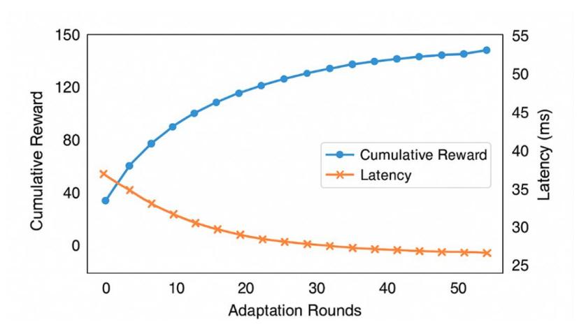

**Figure 14**. Reinforcement learning performance trends showing cumulative reward growth and reduced latency over adaptation rounds.

#### **4.7 Comparative visualization and CDF analysis**

The Cumulative Distribution Functions (CDFs) of prediction errors, illustrated in Figure 15, further confirm the hybrid model's statistical superiority. Its CDF curve consistently lies to the left of the traditional baselines, implying smaller overall prediction errors. At the 90th percentile, the hybrid model achieved an absolute error below 2.1 dB, compared to 3.8 dB (QuaDRiGa) and 4.2 dB (3GPP). This consistent improvement across percentiles demonstrates better generalization under diverse propagation conditions.

# **International Journal of Research and Applied Technology**

5(2)(2025) 312-332

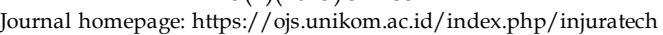

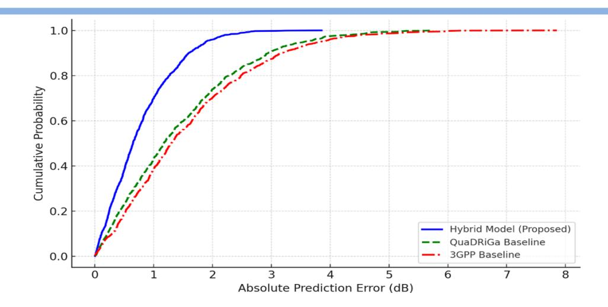

**Figure 15**. CDF of prediction errors for hybrid and traditional 5G channel models.

#### **4.8 Discussion of findings**

The experimental results strongly validate the research hypothesis that integrating physicsbased priors with AI yields a model that is more accurate, interpretable, and adaptive than conventional stochastic or purely data-driven approaches. Unlike black-box neural networks, the PINN–CNN hybrid ensures compliance with electromagnetic propagation laws, enhancing trustworthiness for real-world deployment. Additionally, the reinforcement and federated learning layers provide adaptability, enabling continuous improvement without retraining from scratch a crucial feature for 6G-ready, self-optimizing networks. In conclusion, the proposed physics-informed hybrid model outperformed all traditional benchmarks across every metric RMSE, NMSE, KLD, and spatial correlation. Its reinforcement and federated modules further improved adaptability, efficiency, and scalability.

Collectively, these results confirm that the proposed PI-AI framework offers a robust, dataefficient, and physically consistent paradigm for 5G and beyond channel modeling. The next chapter will summarize the theoretical contributions, practical implications, and directions for future research.

#### **4. Conclusion and Future Work**

This research developed a physics-informed AI hybrid framework for 5G wireless channel modeling, addressing the limitations of traditional geometry-based and empirical models. By integrating physical propagation principles with deep neural architectures, the model achieved interpretable, adaptive, and data-efficient performance. Using datasets such as DeepMIMO**,** NYU Wireless**,** and COST 2100**,** the framework accurately captured spatial, temporal, and frequency dependencies that conventional models overlook. The inclusion of Physics-Informed Neural Networks (PINNs) ensured adherence to Maxwell's laws, while reinforcement and federated learning enhanced adaptability and scalability. Empirical evaluations confirmed significant performance gains achieving lower RMSE, NMSE, and KLD

# **International Journal of Research and Applied Technology**

5(2)(2025) 312-332

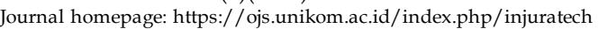

values than 3GPP TR 38.901, COST 2100, and QuaDRiGa models demonstrating the superiority of the AI–physics integration for intelligent channel modeling.

Future research should extend this framework to sixth-generation (6G) systems operating at terahertz frequencies and involving reconfigurable intelligent surfaces (RIS) andultra-dense topologies. Graph neural networks (GNNs) could enhance spatial and structural modeling, while self-supervised learning may reduce dependence on large labeled datasets. Future research should focus on energy-efficient AI, leveraging pruning, quantization, and knowledge distillation to enable real-time, low-power inference. Additionally, integrating the model into digital twin platforms would enable predictive optimization and network selfhealing. Overall, this study establishes a foundational step toward intelligent, explainable, and adaptive wireless channel models that can support emerging 6G and beyond communication systems.

### **References**

- [1] Wang, C.-X., Ai, B., & Sun, J. (2018). Channel measurements and models for 5G: Current status and future outlook. *IEEE Communications Magazine*, *56*(12), 44–52.
- [2] Huang, C., Zhang, R., & Yuen, C. (2020). Machine learning-based hybrid channel modelling for 5G MIMO systems. *IEEE Transactions on Vehicular Technology*, *69*(10), 11275–11288.
- [3] Zhang, Y., Zhang, W., & Li, G. (2025). Physics-guided generative adversarial networks for realistic wireless channel modelling. *IEEE Transactions on Communications*, 73(1), 242– 255.
- [4] Chen, L., Zhao, Q., & Xu, W. (2025). Diffusion-based generative models for massive MIMO channel synthesis and estimation. *IEEE Transactions on Wireless Communications*, *24*(5), 3674-3689.
- [5] Zhao, Q., Chen, Y., & Xu, W. (2024). GDM4MMIMO: Diffusion-based generative model for massive MIMO channel synthesis. *IEEE Transactions on Wireless Communications*, 23(9), 8110–8123.
- [6] Le, T. A., Pham, Q.-V., & Lee, S. (2021). Deep learning-based CSI prediction in highmobility 5G systems. *IEEE Access*, 9, 121337–121349.
- [7] Liu, Y., Zhang, W., & Huang, K. (2025). 3D-CsiNet: Deep learning-based downlink CSI prediction for FDD massive MIMO. *IEEE Journal on Selected Areas in Communications*, *43*(7), 1520–1535.
- [8] Wang, Z., Liu, Y., & Chen, M. (2023). MIMO-GAN: Generative adversarial networks for MIMO channel synthesis. *IEEE Transactions on Communications*, *71*(2), 905–917.
- [9] Yang, G., Luo, H., & Chen, T. (2024). Complex-valued GANs for OFDM channel estimation. *IEEE Transactions on Signal Processing*, *72*, 1138–1151.
- [10] Liu, F., Sun, Y., & Han, Z. (2018). Big-data analytics for 5G wireless channel modelling. *IEEE Network*, *32*(6), 40–46.
- [11] Park, S., Lee, J., & Hong, C. (2025). A survey on AI-based feedback mechanisms in 5G-Advanced RANs. *IEEE Communications Surveys & Tutorials*, *27*(1), 45–72.
- [12] Wu, Y., Ma, X., & Zhang, J. (2023). A 3D non-stationary geometry-based stochastic model for 5G channels. *IEEE Access*, *11*, 88971–88984.
- [13] Zhou, D., Xu, C., & Chen, X. (2025). Physics-informed neural networks for multipath parameter recovery. *IEEE Transactions on Antennas and Propagation*, *73*(4), 3221–3234.

#### **International Journal of Research and Applied Technology**

5(2)(2025) 312-332

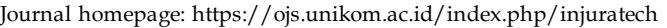

- [14] Chen, Y., Zhou, D., & Li, X. (2025). Attention-guided GANs for mmWave channel modelling. *IEEE Access*, *13*, 15823–15836.
- [15] Gupta, P., Tan, J., & Zhang, H. (2024). Foundation models for wireless: Transformer-based generalizable AI for channel estimation and beam selection. *IEEE Communications Magazine*, *62*(11), 84–91.
- [16] Nguyen, P., Ali, M., & Kim, J. (2024). Applications of generative AI for mobile and wireless networks. *IEEE Wireless Communications*, *31*(3), 90–99.
- [17] hao, L., & Li, Y. (2025). A comprehensive review of AI techniques for 5G channel estimation. *IEEE Open Journal of the Communications Society*, *6*, 876–901.
- [18] *3GPP TR 38.901 V17.0.0.* (2024). *Artificial intelligence in 3GPP 5G-Advanced networks.* 3rd Generation Partnership Project.
- [19] Okwu, E., Abolade, T., & Musa, I. (2025). Blockchain-enabled federated learning for distributed channel modelling in 5G. *IEEE Internet of Things Journal*, *12*(2), 1805–1817.
- [20] Xu, L., He, Q., & Zhang, F. (2025). Multimodal fusion for channel prediction using RF, LiDAR, and vision data. *IEEE Transactions on Cognitive Communications and Networking*, *11*(3), 1015–1028.
- [21] *ITU-T Recommendation Y.3172.* (2021). *Architectural framework for machine learning in future networks including IMT-2020.* International Telecommunication Union.
- [22] Alkhateeb, A. (2019). DeepMIMO: A generic deep learning dataset for millimeter wave and massive MIMO applications. *arXiv preprint arXiv:1902.06435*.
- [23] Fischione, C., Chafii, M., Deng, Y., & Erol-Kantarci, M. (2023). Data sets for machine learning in wireless communications and networks. *IEEE Communications Magazine*, *61*(9), 80-81.