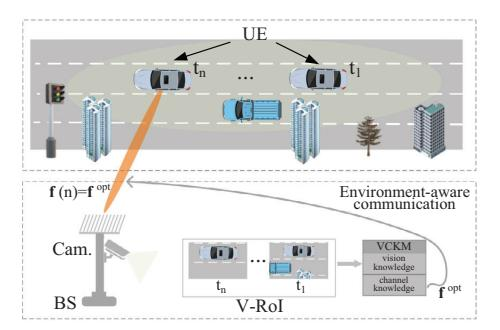
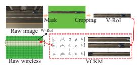
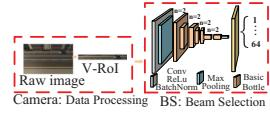
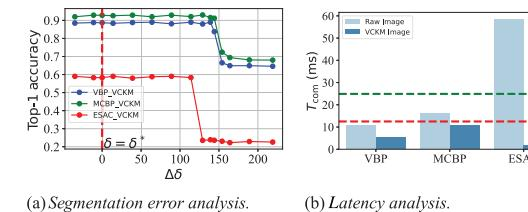
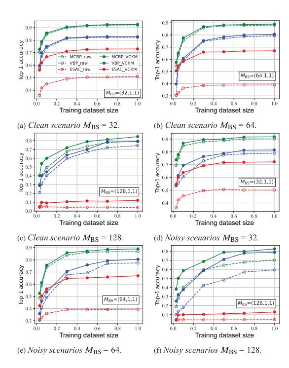

## **Vision Channel Knowledge Map-Aided mmWave Beam Selection in V2I Communications**

Changpeng Zhou1 Youyun Xu1,2 Xiaoming Wang1 Liu Liu1 Tingting Zhang1 Huawei Tong1

1 School of Communications and Information Engineering, Nanjing University of Posts and Telecommunications, Nanjing, China 2National Engineering Research Center of Communications and Networking, Nanjing University of Posts and Telecommunications, Nanjing, China

**Correspondence:** Youyun Xu [\(yyxu@njupt.edu.cn\)](mailto:yyxu@njupt.edu.cn)

**Received:** 17 March 2025 **Revised:** 27 June 2025 **Accepted:** 18 July 2025

**Funding:** This work was supported partly by the National Key Research and Development Program of China under Project No. 2016YFE0200200; in partly bythe National Natural Science Foundation of China under Project No. 62371246.

## **ABSTRACT**

Vision-aided millimetre wave beam selection has gained widespread attention because of its ability to reduce pilot overhead. However, its practical deployment faces challenges due to image transmission latency and high computational overhead. In this letter, we propose a novel environment-aware communication method called the vision channel knowledge map (VCKM), which minimises redundant image information and improves beam selection performance. To evaluate the method, we use the ViWi colo-cam scenario dataset, simulation results show that the VCKM-aided beam selection has better performance than the existing solutions.

## **1 Introduction**

Beam selection is a critical technology for overcoming attenuation of high frequency signals, particularly in millimetre wave (mmWave) vehicle-to-infrastructure (V2I) communications [\[1\]](#page-4-0). Traditional mmWave beam selection primarily relies on channel state information (CSI) estimation or beam sweeping [\[2\]](#page-4-0). However, these approaches introduce considerable system overhead and latency, which become even more challenging in high mobility scenarios. Recently, some studies have focused on using vision information to assist mmWave beam selection [\[3–11\]](#page-4-0). Vision-based approaches leverage external sources, such as images captured by user equipment (UE) or base stations (BS), without consuming communication resources.

In references [\[3–6\]](#page-4-0), the authors explored vision-aided beam selection using deep learning, including ResNet, LSTM and encoder–decoder architectures. While these methods achieved promising results, they relied solely on raw images, limiting generalisation in complex environments. In references [\[7–11\]](#page-5-0), the authors introduced feature-based approaches, extracting geometric, semantic, or 3D object information to enhance beam selection. Although these techniques improved adaptability, the high computational complexity of feature extraction remains a challenge for real-time V2I communication.

In reference [\[12\]](#page-5-0), the authors introduced the concept of a channel knowledge map (CKM) for environment-aware communication. The CKM serves as a location-specific database that associates spatial locations with the channel knowledge of BSs or UEs, offering a new perspective on environment-aware communication. Studies in references [\[13–17\]](#page-5-0) have explored various CKM models and their variants, demonstrating their potential in wireless communication. However, existing CKM-based research primarily focuses on location data. In contrast, vision information provides more fine-grained environmental awareness, greater adaptability and lower deployment costs. These factors make vision information a promising alternative for CKM construction. However, to the best of authors' knowledge, the integration of

This is an open access article under the terms of the [Creative Commons Attribution-NonCommercial-NoDerivs](http://creativecommons.org/licenses/by-nc-nd/4.0/) License, which permits use and distribution in any medium, provided the original work is properly cited, the use is non-commercial and no modifications or adaptations are made.

© 2025 The Author(s). *Electronics Letters* published by John Wiley & Sons Ltd on behalf of The Institution of Engineering and Technology.

vision information into CKM design remain has not been studied and resolved yet.

In this letter, we propose a novel environment-aware communication framework, called the vision channel knowledge map (VCKM). Unlike traditional vision-aided beam selection approaches that aim to enhance the performance of a global model, our method focuses on developing a personalised model tailored to each specific service area. In other words, VCKM is specifically designed for individual service regions. Our key contributions are as follows:

- We propose a personalised VCKM-assisted beam selection strategy, where each service region is assigned an independent knowledge map, enhancing adaptability to dynamic environments and improving beam selection accuracy. This tailored approach significantly increases the feasibility of realworld deployment by reducing computational overhead and ensuring robust localisation in practical V2I scenarios.
- We develop a systematic approach to construct the VCKM, which associates visual and channel knowledge in a structured and scalable manner. A vision region of interest (V-RoI) selection algorithm is introduced to eliminate redundant visual data, reducing computational complexity and transmission overhead.
- We present a minimum filtering-based static background modeling method that effectively suppresses background noise and enhances the extraction of meaningful dynamic features
- We evaluate the proposed framework using the public ViWi dataset, demonstrating its superiority over conventional beam selection approaches. Simulation results validate that VCKMaided beam selection achieves higher prediction accuracy while significantly reducing computational and storage overhead.

#### 2 | System Model

This section provides a detailed description of the mmWave wireless communication system and the associated channel models.

We considered a mmWave V2I communication scenario, which includes a BS and fixed camera. The field of the cameras covers the service area of the BS, as shown in Figure 1. The BS is equipped with a uniform linear array (ULA) comprising  $M_{\rm BS}$  mmWave antenna elements and communicates with a single-antenna UE. The system adopts orthogonal frequency division multiplexing (OFDM) with K subcarriers [10]. For practicality, the BS is assumed to employ an analog-only beamforming architecture, pre-defined beam codebook is  $\mathcal{F} = \{\mathbf{f}_b\}_{b=1}^B, \mathbf{f}_b \in \mathbb{C}^{M_{\rm BS}\times 1}$  and B is the total number of beamforming vectors in the codebook. The received downlink signal at the UE for the kth subcarrier is given by

$$y_k = \mathbf{H}_k^T \mathbf{f}_h s_k + n_k, \tag{1}$$

where  $\mathbf{H}_k \in \mathbb{C}^{M_{\mathrm{BS}} \times 1}$  is the channel matrix for the kth subcarrier,  $s_k \in \mathbb{C}$  is a transmitted symbol with  $\mathrm{E}\{|s_k|^2\} = P_k, P_k$  denoting

FIGURE 1 | The mmWave V2I wireless communication system with VCKM.

the power budget per symbol and  $n_k$  is a noise from Gaussian distribution  $n_k \sim \mathcal{N}_{\mathbb{C}}(0, \sigma^2)$  [11].

This study uses the geometric mmWave channel model [7, 18], the channel matrix at the kth subcarrier is

$$\mathbf{H}_{k} = \sum_{l=0}^{D-1} \sum_{l=1}^{L} \alpha_{l} e^{-j\frac{2\pi k}{K}} d\mathbf{g} (dT_{s} - \tau_{l}) \mathbf{a}(\theta_{l}, \phi_{l}), \tag{2}$$

where is D denotes the cyclic prefix length, L is the number of channel paths,  $\alpha_l$ ,  $T_s$ ,  $\tau_l$ ,  $\theta_l$  and  $\phi_l$  are the path gains, the sampling time, delay, path's azimuth and elevation angles of the departure (AOD) of path l, respectively, and  $g(\cdot)$  denotes the pulse shaping filter.

The beam selection problem is finding the optimal beamforming vector  $\mathbf{f}^{\mathrm{opt}}$  from  $\mathcal{F}$  to maximise the average achievable rate, which is represented as

$$\mathbf{f}^{\text{opt}} = \underset{\mathbf{f}_b \in \mathcal{F}}{\operatorname{argmax}} \frac{1}{K} \sum_{k=1}^{K} \log_2(1 + \rho | \mathbf{H}_k^T \mathbf{f}_b|^2), \tag{3}$$

where  $\rho$  denotes the signal-to-noise ratio (SNR).

# 3 | VCKM-Aided mmWave Beam Selection in V2I Communications

The communication environment's spatial features determine the channel information, which RGB images can capture [7, 13]. We propose a VCKM-based beam selection scheme that uses RGB images to acquire wireless environment data for accurate beam selection. The scheme includes two main tasks, offline mapping of channel and vision knowledge and online prediction involving image pre-processing at the camera and beam prediction at the BS. The detailed process is as follows.

## 3.1 | Offline Mapping

The VCKM serves as a structured knowledge map for a BS, containing channel and vision knowledge of the region of interest (RoI), as shown in Figure 2a. We define the BS service area as the wireless region of interest (W-RoI). We assume UEs are

2 of 6 Electronics Letters, 2025

(a) Offline mapping

(b) Online prediction.

FIGURE 2 | Offline mapping and online prediction of VCKM.

confined to road areas and focus channel analysis accordingly. The W-RoI is divided into segments and used as data sampling sites. Let M denote the set of potential service sites, expressed as  $M = \{1, 2, ..., m\}$ , where m is the total number of sites. Each site may store key channel parameters, including path gain  $\alpha$ , phase ph, zenith AoD  $\theta$ , azimuth AoD  $\phi$  or optimal beam index b.

Meanwhile, the raw image should be collected to ensure spatial and temporal consistency between wireless and vision data. The resulting sequence of images is denoted as  $\mathcal{P} = \{P_t(x,y)|t=1,2,...,N\}$ , where each  $P_t(x,y)$  represents the pixel intensity at spatial coordinates (x,y) at t. The V-RoI is defined as the minimal subset of pixels that effectively represent the dynamic characteristics of the W-RoI while filtering out static background elements.

In this letter, we propose a static background modeling and V-RoI detection method based on minimum filtering. Assuming the pixel intensity at (x, y) follows a bimodal distribution, the probability density function is given by

$$p(P_t(x, y)) = \eta p_R(P_t(x, y)) + (1 - \eta) p_E(P_t(x, y)), \tag{4}$$

where  $p_B(P_t(x,y))$  and  $p_F(P_t(x,y))$  represent the probability density functions of the background and V-RoI pixel intensities, respectively, and  $\eta \in [0,1]$  denotes the proportion of frames where the pixel belongs to the background. If the background remains unchanged throughout the sequence, its intensity is relatively stable, whereas V-RoI objects appear in only a subset of frames with distinct intensities. If the background is visible in most frames  $(\eta > 0.5)$ , then as the number of frames N increases, the minimum operation will converge to the true value of the background pixels as

$$\lim_{N \to \infty} \min_{t \in [1,N]} P_t(x,y) \approx B(x,y),\tag{5}$$

where B(x, y) is the estimated background model.

To extract V-RoI regions, we compute the absolute difference between the background model and each input image, we have  $D_t(x,y) = |P_t(x,y) - B(x,y)|$ , where  $D_t(x,y)$  represents the change difference image at frame t. To reduce noise and enhance the changed regions, we compute the mean of the difference images across all time frames by

$$D_{\text{mean}}(x, y) = \frac{1}{N} \sum_{t=1}^{N} D_{t}(x, y),$$
 (6)

a V-RoI mask is then derived by thresholding the mean difference image

$$M(x,y) = \begin{cases} 0, & D_{\text{mean}}(x,y) < \delta \\ 1, & D_{\text{mean}}(x,y) \ge \delta \end{cases}, \tag{7}$$

where  $\delta$  is the segmentation threshold, determined using Otsu's method for optimal segmentation. Given a pixel intensity range of [0,L], a segmentation threshold  $\delta$  divides the pixels into background  $(0 \le x < \delta)$  and V-RoI  $(\delta \le x \le L)$ . The between-class variance is defined as

$$V_R^2(\delta) = \omega_0(\delta)\omega_1(\delta)(\mu_0(\delta) - \mu_1(\delta))^2, \tag{8}$$

where  $\omega_0(\delta)$  and  $\omega_1(\delta)$  denote the proportions of background and V-RoI pixels, while  $\mu_0(\delta)$  and  $\mu_1(\delta)$  represent their respective mean intensities. The optimal segmentation threshold  $\delta^*$  is selected to maximise the between-class variance:

$$\delta^* = \arg\max_{\hat{s}} \mathcal{V}_B^2(\delta). \tag{9}$$

Once the static mask M(x, y) is obtained, the V-RoI is extracted by filtering the raw images by

$$V_{\text{RoI}} = \{(x, y) | M(x, y) = 1\}. \tag{10}$$

This process ensures that only V-RoI regions are retained while static elements are discarded, providing a refined visual representation for beam selection. Finally, the extracted channel and vision knowledge are mapped and stored in the VCKM as

$$\mathbf{V} = \begin{bmatrix} \alpha_1 & ph_1 & \theta_1 & \phi_1 & b_1 & V_{\text{RoI},1} \\ \vdots & \vdots & \vdots & \vdots & \vdots & \vdots \\ \alpha_n & ph_n & \theta_n & \phi_n & b_n & V_{\text{RoI},n} \end{bmatrix}.$$
(11)

## 3.2 | Online Prediction

The architecture of the online beam selection system is illustrated in Figure 2b. At camera, V-RoI regions are extracted based on Equation (10). Each V-RoI is then annotated with the corresponding camera identifier and timestamp.

Subsequently, the processed V-RoI with its metadata is transmitted to the BS processor via a mmWave backhaul link [19]. In the beam selection process, VCKM is compatible with a wide range of image-assisted beam selection approaches. To illustrate the overall workflow, we present an example using a ResNet-18-based classification model. It is important to note that this choice is solely for demonstration purposes and does not restrict the general applicability of VCKM to other models or frameworks. The input to the beam selection network is the pre-processed V-RoI image. The backbone model consists of an 18-layer residual network that is pretrained on the widely used ImageNet 2012 dataset and then fine-tuned for the beam prediction task. The model outputs the optimal beam index corresponding to the highest expected received power, enabling real-time beam alignment decisions in dynamic vehicular scenarios.

TABLE 1 | Hyper-parameters for network fine-tuning.

| Parameter                      | VBP                | МСВР               | ESAC               |
|--------------------------------|--------------------|--------------------|--------------------|
| ML model                       | ResNet-18          | ResNet-50          | LeNet-5            |
| Batch size                     | 150                | 32                 | 64                 |
| Learning rate                  | $1 \times 10^{-4}$ | $1 \times 10^{-4}$ | $1 \times 10^{-3}$ |
| Learning rate decay            | Epochs 4 and 8     | Epochs 4 and 8     | Epochs 10 and 20   |
| Learning rate reduction factor | 0.1                | 0.1                | 0.1                |
| Total training epochs          | 15                 | 15                 | 30                 |

### 4 | Performance Evaluation

To evaluate the effectiveness of the proposed VCKM-based beam selection method, we utilised the publicly available ViWi dataset and selected the colo-cam scenario for validation [3]. We formulate the beam selection problem as a classification task. The model output is a predicted beam index  $\hat{b} \in \{1, 2, ..., B\}$ , where B is the size of the pre-defined codebook. Let ground truth label  $b^*$  denote the optimal beam index corresponding to  $\mathbf{f}^{\text{opt}}$ . The beam selection accuracy is defined as

Accuracy = 
$$\frac{1}{S} \sum_{i=1}^{S} \mathbb{I}(\hat{b}_i = b_i^*),$$
 (12)

where S is the total number of samples and  $\mathbb{I}(\cdot)$  is the indicator function.

We compared the performance of three advanced methods, with and without the use of VCKM: the vision-aided beam prediction (VBP) in reference [18], the camera-based multicandidate beam prediction (MCBP) in reference [20] and the environment semantic-aided communication (ESAC) in reference [21]. VBP and MCBP utilise raw images as inputs to their machine learning networks, employing ResNet-18 and the higher-dimensional ResNet-50 models, respectively. In contrast, ESAC first extracts semantic information from the raw images and then feeds this information into the network, which is based on the lightweight LeNet-5 model. Their network fine-tuning hyper-parameters are listed in Table 1. It is important to note that for each method, whether based on the raw images or VCKM, all network fine-tuning hyper-parameters remain the same.

We first investigate the impact of segmentation threshold error  $(\Delta \delta = \delta - \delta^*)$  in the V-RoI masking process on beam selection accuracy. To assess the robustness of the proposed approach, we evaluate the VCKM-based VBP, MCBP and ESAC methods under varying levels of segmentation threshold estimation error. Using Equation (9) we get the optimal segmentation value is  $\delta^* = 36$ ,  $\delta \in [1,255]$ , the deviation range is  $\Delta \delta \in [-35,219]$ .

As shown in Figure 3a, all three methods maintain high and stable Top-1 beam selection accuracy over a broad threshold deviation range, forming a clear performance plateau. This indicates the robustness of the proposed region-constraining mechanism against threshold variations. However, each model has a critical deviation threshold beyond which accuracy drops sharply. This drop occurs because excessively high deviation exclude a large

FIGURE 3 | Segmentation error and latency analysis of VBP, MCBP and ESAC under the VCKM scheme.

portion of dynamic regions, losing crucial motion information essential for accurate beam selection.

We next randomly selected 70% of the data from the colocam scenario as the training dataset and constructed subsets of varying sizes to evaluate the performance of the VCKM-based beam selection methods under different training data scales. As shown in Figure 4a-c, the proposed VCKM-aided VBP, MCBP and ESAC consistently outperform their counterparts that rely on raw images. Notably, applying VCKM in ESAC yields significant performance gains—up to 20% for antenna arrays (32,1,1) and (64,1,1). In contrast, VBP and MCBP show minimal improvement due to their stronger robustness to irrelevant background, stemming from deeper models' ability to learn high-level features. However, ESAC performance drops sharply with the (128,1,1) array, as it relies on grayscale semantic inputs. Higher codebook resolution reduces sample diversity, and the shallow LeNet-5 struggles to extract rich features, lowering beam selection accuracy. Nevertheless, the proposed VCKM consistently outperforms across all configurations.

Based on the aforementioned dataset partitioning, we randomly added noise to 50% of the images in each group. As illustrated in Figure 4d–f, the beam selection methods enhanced by VCKM demonstrate stronger robustness, whereas the accuracy of methods relying on raw images drops significantly. This improvement is primarily attributed to the VCKM's V-RoI extraction mechanism, which effectively filters out irrelevant regions and noise, enabling the model to better focus on beam-relevant features and maintain reliable performance in noisy environments. Additionally, we observe that the ESAC method is relatively less affected by noise. This resilience can be credited to its semantic information extraction stage, which filters out noise and provides higher-quality input for online beam selection. However, this process also introduces additional computational overhead and latency to the wireless communication system.

4 of 6 Electronics Letters, 2025

FIGURE 4 | Top-1 prediction accuracy analysis of VBP, MCBP and ESAC under the VCKM scheme.

To assess the latency of the proposed VCKM-based beam selection in V2I scenarios, we perform a system-level end-to-end simulation. The total latency is defined as the sum of three main components: image acquisition and pre-processing time ( $T_{\rm irr}$ ), image transmission time ( $T_{\rm itr}$ ) and beam selection prediction time ( $T_{\rm sel}$ ). Thus, the overall communication latency is expressed as:  $T_{\rm com} = T_{\rm irr} + T_{\rm itr} + T_{\rm sel}$ .

The raw image resolution is  $1280 \times 720$  from the Camera 2 of the ViWi colo-cam dataset. Based on Equation (9),  $\delta^* = 36$ . As a segmentation result, the image size is reduced to  $1280 \times 90$ . The data size is only 12.5% of the original.

In simulation, the BS uses a 64 element ULA with an element spacing of  $d=\lambda/2$  at 60 GHz. The 3 dB beamwidth is approximately 1.59° [22]. Assuming a communication distance of 15 m, the spatial beam footprint can be estimated as  $L_{\rm bf}=2\times15\times \tan(1.59^\circ/2)\approx 0.416$  m. At a vehicle speed of 60 km/h (equivalent to 16.7 m/s), the time required for a vehicle to traverse a single beam footprint is approximately,  $t_{s60}=0.416/16.7\approx24.9$  ms, in a higher-speed scenario, such as a vehicle traveling at 120 km/h (equivalent to 33.3 m/s), the beam traversal time is further reduced to  $t_{s120}\approx12.5$  ms.

The results show that higher vehicle speeds reduce beam dwell time, demanding faster beam selection. As shown in Figure 3b, the ESAC scheme incurs excessive delay due to YOLO v7, exceeding the beam switching threshold and risking failure. MCBP with raw images faces similar issues. In contrast, the proposed VCKM

compresses images via V-RoI, greatly reducing transmission and inference time, keeping total latency well below the threshold and improving real-time beam switching reliability.

### 5 | Conclusion

In this letter, we propose an image-aided environment-aware communication method to reduce image transmission latency and computational complexity. Specifically, we propose VCKM that establishes a mapping between vision and channel information while minimising image redundancy by extracting V-RoI. Furthermore, we design a VCKM-aided beam selection network to achieve optimal beam pair selection with the most compact image. Experimental results demonstrate that the proposed method outperforms existing approaches in prediction accuracy. In future work, scene variation handling can be incorporated to improve the adaptability of the proposed VCKM framework. Specifically, techniques such as dynamic scene change detection and adaptive model updating can be investigated to enable VCKM to respond to changes in the environment, including moving objects, structural alterations and transient obstructions. This would allow the framework to maintain high beam selection accuracy under more realistic and time-varying conditions.

#### **Author Contributions**

Changeng Zhou: conceptualization, formal analysis, investigation, methodology, software, writing – original draft, writing – review and editing. Youyun Xu: conceptualization, funding acquisition, project administration, resources, supervision. Xiaoming Wang: formal analysis, writing – original draft. Liu Liu: data curation, software. Tingting Zhang: data curation. Huawei Tong: data curation.

## **Conflicts of Interest**

The authors declare no conflicts of interest.

## **Data Availability Statement**

The data that support the findings of this study are available from the corresponding author upon reasonable request.

# References

- 1. J. Chen, P. Zhao, Z. Wang, and J. Quan, "Enhanced Beam Selection for Multi-User mm-Wave Massive MIMO Systems," *Electronics Letters* 52, no. 14 (2016): 1268–1270.
- R. Zhang, H. Zhang, and W. Xu, "Fast Beam Alignment Algorithm for Multi-User Mmwave Communications," *Electronics Letters* 54, no. 25 (2018): 1456–1458.
- 3. M. Alrabeiah, A. Hredzak, Z. Liu, and A. Alkhateeb, "ViWi: A Deep Learning Dataset Framework for Vision-Aided Wireless Communications," in 2020 IEEE 91st Vehicular Technology Conference (VTC2020-Spring) (IEEE, 2020), 1–5.
- 4. Y. Tian, G. Pan, and M. S. Alouini, "Applying Deep-Learning-Based Computer Vision to Wireless Communications: Methodologies, Opportunities, and Challenges," *IEEE Open Journal of the Communications Society* 2 (2021): 132–143.
- G. Charan, M. Alrabeiah, and A. Alkhateeb, "Vision-Aided 6G Wireless Communications: Blockage Prediction and Proactive Handoff," *IEEE Transactions on Vehicular Technology* 70, no. 10 (2021): 10193–10208.

- 6. S. Jiang and A. Alkhateeb, "Computer Vision Aided Beam Tracking in A Real-World Millimeter Wave Deployment," in *2022 IEEE Globecom Workshops (GC Workshops)* (IEEE, 2022), 142–147.
- 7. W. Xu, F. Gao, X. Tao, J. Zhang, and A. Alkhateeb, "Computer Vision Aided mmWave Beam Alignment in V2X Communications," *IEEE Transactions on Communications* 22, no. 4 (2023): 2699–2714.
- 8. Y. Ahn, J. Kim, S. Kim, S. Kim, and B. Shim, "Sensing and Computer Vision-Aided Mobility Management for 6G Millimeter and Terahertz Communication Systems," *IEEE Transactions on Communications* 72, no. 10 (2024): 6044–6058.
- 9. H. Wang, D. Yang, and X. Xie, "A Deep Reinforcement Learning-Based Beam Prediction Scheme for Vision-Aided mmWave Wireless Communications," *IEEE Internet Things Journal* 12, no. 11 (2025): 17869– 17879.
- 10. Y. Ahn, J. Kim, S. Kim, et al., "Toward Intelligent Millimeter and Terahertz Communication for 6G: Computer Vision-Aided Beamforming," *IEEE Wireless Communications* 30, no. 5 (2023): 179–186.
- 11. Y. Yang, F. Gao, X. Tao, G. Liu, and C. Pan, "Environment Semantics Aided Wireless Communications: A Case Study of mmWave Beam Prediction and Blockage Prediction," *IEEE Journal on Selected Areas in Communications* 41, no. 7 (2023): 2025–2040.
- 12. Y. Zeng and X. Xu, "Toward Environment-Aware 6G Communications via Channel Knowledge Map," *IEEE Wireless Communications* 28, no. 3 (2021): 84–91.
- 13. Y. Zeng, J. Chen, J. Xu, et al., "A Tutorial on Environment-Aware Communications via Channel Knowledge Map for 6G," *IEEE Communications Surveys & Tutorials* 26, no. 3 (2024): 1478–1519.
- 14. D. Wu, Y. Zeng, S. Jin, and R. Zhang, "Environment-Aware and Training-Free Beam Alignment for mmWave Massive MIMO via Channel Knowledge Map," in *2021 IEEE International Conference on Communications Workshops (ICC Workshops)* (IEEE, 2021), 1–7.
- 15. D. Wu, Y. Zeng, S. Jin, and R. Zhang, "Environment-Aware Hybrid Beamforming by Leveraging Channel Knowledge Map," *IEEE Transactions on Wireless Communications* 23, no. 5 (2024): 4990–5005.
- 16. W. Xu, F. Gao, X. Tao, J. Zhang, and A. Alkhateeb, "Alkhateeb, Computer Vision Aided mmWave Beam Alignment in V2X Communications," *IEEE Transactions on Wireless Communications* 22, no. 4 (2023): 2699–2714.
- 17. X. Xu and Y. Zeng, "How Much Data Is Needed for Channel Knowledge Map Construction?," *IEEE Transactions on Wireless Communications* 23, no. 10 (2024): 13011–13021.
- 18. M. Alrabeiah, A. Hredzak, and A. Alkhateeb, "Millimeter Wave Base Stations With Cameras: Vision-Aided Beam and Blockage Prediction," in *2020 IEEE 91st Vehicular Technology Conference (VTC2020-Spring)* (IEEE, 2020), 1–5.
- 19. M. M. Al-Quraan, A. R. Khan, L. Mohjazi, A. Centeno, A. Zoha, and M. A. Imran, "Intelligent Beam Blockage Prediction for Seamless Connectivity in Vision-Aided Next-Generation Wireless Networks," *IEEE Transactions on Network and Service Management* 20, no. 2 (2023): 1937–1948.
- 20. G. Charan, M. Alrabeiah, T. Osman, and A. Alkhateeb, "Camera Based mmWave Beam Prediction: Towards Multi-Candidate Real-World Scenarios," *IEEE Transactions on Vehicular Technology* 74, no. 4 (2025): 5897–5913.
- 21. S. Imran, G. Charan, and A. Alkhateeb, "Environment Semantic Aided Communication: A Real World Demonstration for Beam Prediction," in *2023 IEEE International Conference on Communication Workshops (ICC Workshops)* (IEEE, 2023), 48–53.
- 22. J. Gao, K. Li, T. Sato, J. Wang, H. Harada, and S. Kato, "Implementation Considerations of Patch Antenna Array for 60GHz Beam Steering System Applications," in *2009 IEEE Radio and Wireless Symposium* IEEE, San Diego, CA, USA, (2009), 35–38.

6 of 6 *Electronics Letters*, 2025