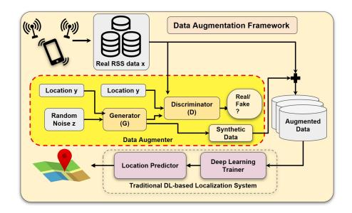
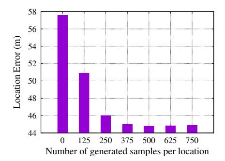

# Data Augmentation using GANs for Deep Learning-based Localization Systems

Joseph Boulis and Mohamed Hemdan Undergraduate Students

The American University in Cairo Egypt

{joseph\_boulis,mashrafhemdan}@aucegypt.edu

# ABSTRACT

Recently, deep learning-based localization systems have become one of the most promising techniques due to their accuracy in complex environments. However, these techniques require large amounts of data for training. Obtaining such data is usually a tedious and time-consuming process, which hinders their practical deployment. In this paper, we propose a data augmentation framework for deep learning-based localization systems. The basic idea is to use a conditional Generative Adversarial Network that is able to learn the complex structures in the original training data and then generate high-quality synthetic data that matches the original data distribution. Evaluation of the proposed data augmentation framework in a real testbed shows that our technique can increase the average localization accuracy by 22.2% compared to the case of not using data augmentation. This demonstrates the promise of the proposed framework for enhancing deep learning-based localization systems.

# CCS CONCEPTS

• Human-centered computing → Ubiquitous and mobile computing.

# KEYWORDS

data augmentation, deep learning localization, GAN

#### ACM Reference Format:

Joseph Boulis and Mohamed Hemdan and Ahmed Shokry and Moustafa Youssef. 2021. Data Augmentation using GANs for Deep

Permission to make digital or hard copies of all or part of this work for personal or classroom use is granted without fee provided that copies are not made or distributed for profit or commercial advantage and that copies bear this notice and the full citation on the first page. Copyrights for components of this work owned by others than ACM must be honored. Abstracting with credit is permitted. To copy otherwise, or republish, to post on servers or to redistribute to lists, requires prior specific permission and/or a fee. Request permissions from permissions@acm.org.

SIGSPATIAL '21, November 2–5, 2021, Beijing, China © 2021 Association for Computing Machinery. ACM ISBN 978-1-4503-8664-7/21/11. . . \$15.00 <https://doi.org/10.1145/3474717.3486807>

Ahmed Shokry and Moustafa Youssef Advisors AUC and Alexandria University Egypt {ahmed.shokry,moustafa-youssef}@aucegypt.edu

Figure 1: The data augmentation framework.

Learning-based Localization Systems. In 29th International Conference on Advances in Geographic Information Systems (SIGSPATIAL '21), November 2–5, 2021, Beijing, China. ACM, New York, NY, USA, [2](#page-1-0) pages.<https://doi.org/10.1145/3474717.3486807>

# 1 INTRODUCTION

Location-based services have become an essential part of our daily life. Generally, GPS is considered the most commonly used technique for localization. However, it requires line-of-sight to the satellites, limiting its ubiquitousness in urban areas, in bad weather conditions, and indoors. In addition, it drains the phone battery quickly [\[4\]](#page-1-1). To overcome these shortcomings, several techniques have been introduced based on WiFi or cellular received signal strength (RSS).

Recently, several WiFi and cellular deep learning-based fingerprinting techniques have been proposed in indoor and outdoor environments that build on the success of deep learning models to achieve high accuracy. These systems collect the fingerprint/training samples (i.e., RSS) at different discrete fingerprint locations. The accuracy of these systems heavily depends on the size and balance (i.e., equal number of samples at each fingerprint training location) of the collected data. Obtaining such data is usually a tedious and time-consuming process, limiting the deployability of such deep learning systems. Consequently, there is a need to develop new techniques that can reduce data collection cost while maintaining the system accuracy.

Different data augmentation techniques have been proposed in literature [3] which use additive noise, sampling, and cell tower dropper. However, these solutions suffer from the reliance on heuristics and oversimplified assumptions, which result in synthetic data that does not match the collected real data's statistical properties, deteriorating the overall localization system accuracy.

#### 2 RESEARCH CONTRIBUTION

In this paper, we propose a data augmentation framework that can be integrated with any deep learning-based localization system. The basic idea is to take as input a small class-unbalanced collected data and use it to generate an arbitrary larger balanced one that can be used for training the deep learning-based localization system.

As part of the framework design, we introduce the *Data Augmenter* module which exploits the superior learning power of the conditional Generative Adversarial Networks (CGAN) to synthesize high-quality, balanced data. This design reduces the efforts of the data collection process while increasing the learning capability of the deep model, which in return improves the localization accuracy. In this section, we start by describing our input data followed by the details of the *Data Augmenter* module.

### 2.1 Input Data

The input data represents the received signal strength at a mobile device received from the surrounding cell-towers at different reference locations in the area of interest. At each reference location, different RSS scans are performed. According to the standard [2], up to seven towers of the total available cell towers in the area can be heard in a single scan. A pair of RSS and Cell ID (CID) is recorded for each heard cell tower. Each scan is tagged with its location, i.e., the longitude and latitude where each scan is recorded.

#### 2.2 The Data Augmenter

The goal of this module is to generate synthetic RSS measurements by using a CGAN. CGAN is a type of GAN that includes a generator and a discriminator that are "conditioned" on location labels in the area of interest.

Figure 1 shows the typical structure of a CGAN. The generator (G) takes a randomly generated noise vector z, which is concatenated with a one-hot encoded location label vector (the condition). The goal of the generator is to learn how to map this random input to RSS data belonging to a specific location (encoded in the input location vector).

The discriminator (D) goal is to distinguish between the fake RSS vectors from the generator G(z) and the real vectors from the original dataset. Accordingly, the discriminator learns to maximize the probability of assigning the "real"

Figure 2: Effect of the amount of generated data on localization accuracy. Zero refers to using the collected data only without any augmentation.

label to real RSS samples (as compared to the generated ones).

The generator and discriminator are trained concurrently in a min-max game [1]. Eventually, when G and D converge to an equilibrium point, the generator network G learns to produce realistic samples that follow the distribution of the real data.

#### 3 EVALUATION

Our CGAN model has been trained on an outdoor localization dataset from [4]. The dataset contains RSS samples taken from 20 cell towers using different Android phones and covering a 1.2 Km2 rural area. Each sample corresponds to one of 25 locations that are used as labels for training.

To observe the effect of the proposed data augmentation technique on performance, we train our localization model with different amounts of generated data.

The results in Figure 2 show that the average localization error decreases as the amount of generated data is increased until it saturates around 375 samples. In particular, the average localization error decreases by 22.2% when using the augmented data.

#### REFERENCES

- Mehdi Mirza and Simon Osindero. 2014. Conditional generative adversarial nets. arXiv preprint arXiv:1411.1784 (2014).
- [2] Hamada Rizk, Moustafa Abbas, and Moustafa Youssef. 2020. OmniCells: Cross-Device Cellular-based Indoor Location Tracking Using Deep Neural Networks. In PerCom. 1–10.
- [3] Hamada Rizk, Ahmed Shokry, and Moustafa Youssef. 2019. Effectiveness of data augmentation in cellular-based localization using deep learning. In 2019 IEEE Wireless Communications and Networking Conference (WCNC). IEEE, 1–6.
- [4] Ahmed Shokry, Marwan Torki, and Moustafa Youssef. 2018. DeepLoc: a ubiquitous accurate and low-overhead outdoor cellular localization system. In Proceedings of the 26th ACM SIGSPATIAL International Conference on Advances in Geographic Information Systems. 339–348.