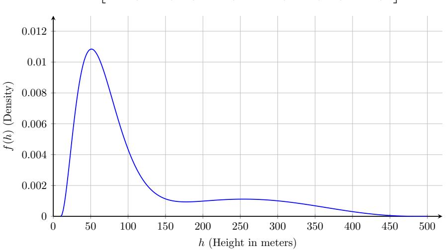

## **UAV** Transmitter Height Distribution

## 1. Generative Sampling Formula

In a simulation pipeline, the exact height h is generated by transforming a normalized variable X sampled from the BMM:

$$h = 10 + 490 \cdot X \tag{1}$$

where  $X \in [0,1]$  is drawn from the mixture distribution:

$$X \sim 0.75 \cdot \text{Beta}(3, 23) + 0.25 \cdot \text{Beta}(4, 4)$$
 (2)

## 2. Probability Density Function (PDF)

By evaluating the Beta function constants  $B(3,23)=\frac{1}{6900}$  and  $B(4,4)=\frac{1}{140}$ , applying the respective component weights (0.75 and 0.25), and performing the change of variables  $X=\frac{h-10}{490}$ , the fully expanded probability density function f(h) defined over the interval  $h\in[10,500]$  is:

$$f(h) = \frac{1}{490} \left[ 5175 \left( \frac{h - 10}{490} \right)^2 \left( \frac{500 - h}{490} \right)^{22} + 35 \left( \frac{h - 10}{490} \right)^3 \left( \frac{500 - h}{490} \right)^3 \right]$$
(3)

