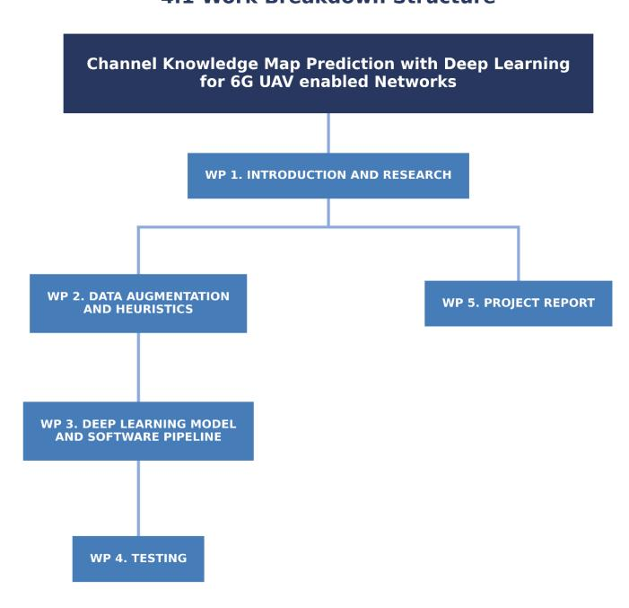
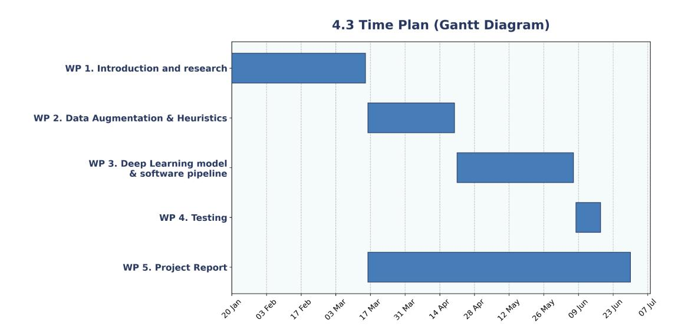

## Channel Knowledge Map Prediction with Deep Learning for 6G UAV-enabled Networks

Guillem Moreno Garcia

Project Proposal and Work Plan

| Document:        | [project | proposal | and |  |  |
|------------------|----------|----------|-----|--|--|
| workplan.doc]    |          |          |     |  |  |
| Date: 04/03/2026 |          |          |     |  |  |
| Rev: 01          |          |          |     |  |  |
| Page 2 of 13     |          |          |     |  |  |

## Project Proposal and Work Plan **Channel Knowledge Map Prediction with Deep Learning for 6G UAV enabled Networks**

## REVISION HISTORY AND APPROVAL RECORD

| Revision | Date       | Purpose                   |
|----------|------------|---------------------------|
| 0        | 16/02/2026 | Document creation      |
| 1        | 26/02/2026 | Document revision 1 |
| 2        | 27/02/2026 | Document revision 2    |
| 3        | 01/03/2026 | Document revision 3       |
| 4        | 02/03/2026 | Document revision 4       |
| 5        | 04/03/2026 | Document submission       |
|          |            |                           |
|          |            |                           |
|          |            |                           |

## DOCUMENT DISTRIBUTION LIST

| Name                  | E-mail                                    |
|-----------------------|-------------------------------------------|
| Guillem Moreno     | guillem.moreno.garcia@estudiantat.upc.edu |
|                       |                                           |
| Sergi Abadal       | sergi.abadal@upc.edu                      |
| Evgenii Vinogradov | evgenii.vinogradov@upc.edu                |
|                       |                                           |
|                       |                                           |
|                       |                                           |
|                       |                                           |
|                       |                                           |

| WRITTEN BY: |                             | REVIEWED AND APPROVED BY: |                       |
|----------------|-----------------------------|------------------------------------|-----------------------|
|                |                             |                                    |                       |
|                |                             |                                    |                       |
| Date           | 16/2/2026                   | Date                               | 02/03/2026            |
| Name           | Guillem Moreno Garcia | Name                               | Sergi Abadal       |
| Position       | Project author           | Position                           | Project Supervisor |

| Document: workplan.doc] | [project | proposal | and |  |
|----------------------------|----------|----------|-----|--|
| Date: 04/03/2026           |          |          |     |  |
| Rev: 01                    |          |          |     |  |
|                            |          |          |     |  |

Page 3 of 13

Project Proposal and Work Plan **Channel Knowledge Map Prediction with Deep Learning for 6G UAV**

**enabled Networks**

| 0. | CONTENTS                            |                                                 |   |
|----|-------------------------------------|-------------------------------------------------|---|
| 0. | Contents                            |                                                 | 3 |
| 1. | Project overview and goals |                                                 | 4 |
| 2. | Project                             | background                                      | 5 |
| 3. | Project                             | requirements and specifications           | 6 |
| 4. | Work                                | Plan                                            | 7 |
|    | 4.1.                                | Work Breakdown Structure                  | 7 |
|    | 4.2.                                | Work Packages, Tasks and Milestones | 7 |
|    | 4.3.                                | Time Plan (Gantt diagram)              | 8 |
|    | 4.4.                                | Meeting and communication plan         | 9 |

5. [Generic](#page-12-0) skills 10

Document: [project proposal and workplan.doc] Date: 04/03/2026 Rev: 01 Page 4 of 13

Project Proposal and Work Plan **Channel Knowledge Map Prediction with Deep Learning for 6G UAV enabled Networks**

## **1. PROJECT OVERVIEW AND GOALS**

This project is carried out at the Nanonetworking Center in Catalonia (N3Cat), part of the Broadband Communications Systems and Architectures Research Group (CBA) within the Department of Computer Architecture.

## **Summary of the subject:**

The deployment of 6G networks introduces a paradigm shift towards environment-aware communications, heavily integrating non-terrestrial nodes such as Uncrewed Aerial Vehicles (UAVs). This transition is accompanied by an industry-wide focus on the FR3 upper-midband spectrum (7.125 GHz, defined as the primary test band in the EU). To optimize these networks without the prohibitive computational overhead of continuous real-time channel estimation, it is critical to proactively predict how radio waves interact with complex 3D urban environments using accurate Channel Knowledge Maps (CKMs). Traditionally, this deterministic modeling is achieved using Ray Tracing (RT) software. While RT provides exceptional physical accuracy, it is extremely computationally heavy and slow. For highly dynamic 3D networks involving mobile UAVs with varying antenna deployment heights, running RT simulations for every possible spatial configuration creates a severe bottleneck. This limits practical scalability and is entirely incompatible with the real-time demands of 6G.

To overcome this limitation, recent literature has focused on data-driven Artificial Intelligence (AI) and Machine Learning (ML) approaches capable of predicting channel parameters directly from environmental geometry. Addressing the RT bottleneck, this project builds upon these foundations by proposing a standalone ML architecture that frames 3D channel prediction as an advanced image-to-image translation problem. By leveraging massive research-grade 3D city datasets (e.g., GlobalBuildingAtlas and 3DglobFP), the model will learn to seamlessly map physical environments directly to radio channel characteristics.

The development pipeline will initially leverage publicly available 5G datasets to establish a methodological baseline for environment-aware Convolutional Neural Networks (CNNs). Subsequently, the project will transition to a proprietary 6G FR3 dataset generated internally by the N3Cat research group.

## **The project main goals are:**

1. Develop a standalone deep learning software architecture capable of predicting key 6G FR3 channel parameters (delay spread, angular spread, and channel power) from 2D ground representation and varying UAV altitudes (up to a maximum height of approximately 500 meters).

| Document:        | [project | proposal | and |
|------------------|----------|----------|-----|
| workplan.doc]    |          |          |     |
| Date: 04/03/2026 |          |          |     |
| Rev: 01          |          |          |     |
| Page 5 of 13     |          |          |     |

Project Proposal and Work Plan **Channel Knowledge Map Prediction with Deep Learning for 6G UAV enabled Networks**

- 2. Accelerate channel generation by achieving a 10x to 100x reduction in computation time compared to traditional ray tracing simulations.
- 3. Attain high prediction accuracy against ground-truth data, targeting a Root Mean Square Error (RMSE) of at most approximately 3 to 5 dB for channel power, 50 ns for delay spread, and 20 degrees for angular spread.
- 4. Implement data augmentation pipelines to compensate for the computational expense of generating massive ground-truth datasets, ensuring the model generalizes well across diverse global urban layouts and good heuristics that make sure that the data outputted by the model makes sense with deterministic known formulas for 6G UAV Enabled networks.

| Document:        | [project | proposal | and |
|------------------|----------|----------|-----|
| workplan.doc]    |          |          |     |
| Date: 04/03/2026 |          |          |     |
| Rev: 01          |          |          |     |
| Page 6 of 13     |          |          |     |

Project Proposal and Work Plan **Channel Knowledge Map Prediction with Deep Learning for 6G UAV enabled Networks**

## **2. PROJECT BACKGROUND**

This project is performed within the framework of the research activities conducted at the Nanonetworking Center in Catalonia (N3Cat). Furthermore, this work stems from the research activities supported by the grant INVESTIGADOR/A POSTDOCTORAL-RAMÓN Y CAJAL, RYC2024-051003-I, funded by MICIU/AEI/10.13039/501100011033 and by the FSE+ (E. Vinogradov is a PI).

While the specific deep learning software architecture, data augmentation pipelines, and model evaluations for this Bachelor's thesis are being developed from scratch by the author, the project strongly leverages foundational methodologies and proprietary 6G FR3 datasets generated by the N3Cat research group.

The main initial ideas for the project (i.e., the conceptualization of framing 6G FR3 channel prediction as an image-to-tensor translation problem using 3D city models and the objective to accelerate channel knowledge map generation for UAV networks) were provided by the project supervisors (Evgenii Vinogradov and Sergi Abadal). The project author is responsible for the autonomous research, design, implementation, and rigorous testing of the machine learning architecture proposed to fulfill these objectives.

| Document:        | [project | proposal | and |
|------------------|----------|----------|-----|
| workplan.doc]    |          |          |     |
| Date: 04/03/2026 |          |          |     |
| Rev: 01          |          |          |     |
| Page 7 of 13     |          |          |     |

Project Proposal and Work Plan **Channel Knowledge Map Prediction with Deep Learning for 6G UAV enabled Networks**

## **3. PROJECT REQUIREMENTS AND SPECIFICATIONS**

## Project requirements:

- Predict delay spread, angular spread, channel power and augmented line of sight for a whole city map based on a deep learning model.
- This will be for 6G FR3 UAV-enabled networks.

## Project specifications:

- Predict delay spread, angular spread, channel power and augmented line of sight based on a height matrix, Z value of the antenna (always in the middle of the image), with a frequency of 7.125GHz which corresponds to the FR3 6G frequency band and a binary line of sight map (this last one optional)
- 3D model of a city -> grayscale images (one matrix or two if it has the binary line of sight) + height of the antenna per image -> output tensors (one per image) with delay Spread, angular spread, channel power and maybe the augmented line of sight.

| Document: workplan.doc] | [project | proposal | and |
|----------------------------|----------|----------|-----|
| Date: 04/03/2026           |          |          |     |
| Rev: 01                    |          |          |     |
| Page 8 of 13               |          |          |     |

Project Proposal and Work Plan **Channel Knowledge Map Prediction with Deep Learning for 6G UAV enabled Networks**

## **4. WORK PLAN**

# 4.1. *Work Breakdown Structure*

(Work packages breakdown diagram)

# 4.2. *Work Packages, Tasks and Milestones*

### Work Packages:

| Project: Channel Knowledge Map Prediction with Deep Learning for 6G UAV-enabledNetworks | WP ref: WP1                       |
|-----------------------------------------------------------------------------------------------------------------------|-----------------------------------------|
| Major constituent: Introduction and Research                                                              | Sheet 1 of 5                   |
| Short description:                                                                                                 | Planned start date: 20/01/2026 |
| Researching the formulas for the channel knowledge map for                                    | Planned end date: 15/03/2026   |
| channel power, angular spread, delay spread and augmented                                        |                                         |

| Document: workplan.doc] | [project | proposal | and |
|----------------------------|----------|----------|-----|
| Date: 04/03/2026           |          |          |     |
| Rev: 01                    |          |          |     |
|                            |          |          |     |

Page 9 of 13

## Project Proposal and Work Plan **Channel Knowledge Map Prediction with Deep Learning for 6G UAV enabled Networks**

| line of sight. Also research the state of the art for image generation (types of CNNs) based on environment-aware parameters, specifically communications. See what has been done for 5G ground based antenna and see the differences that there will be 6G UAV Enabled Networks. | Start event: T1.1 End event: T1.3 |        |
|--------------------------------------------------------------------------------------------------------------------------------------------------------------------------------------------------------------------------------------------------------------------------------------------------------------------------------------------------------------------------------------------------------------------|--------------------------------------------------|--------|
| Internal task T1.1: Research the best parameters for simulations of diverse data of 6G UAV Enabled Networks to then train the Neural Network.                                                                                                                                                                                                    | Deliverables:                                    | Dates: |
| Internal task T1.2: Research the formulas that apply for 6G UAV Enabled Networks                                                                                                                                                                                                                                                                                               |                                                  |        |
| Internal Task T1.3: Do a dummy training of some 5G dataset to learn what are the best networks and how to heuristically improve the results.                                                                                                                                                                                               |                                                  |        |

| Project: Channel Knowledge Map Prediction with Deep Learning for 6G UAV-enabled Networks                                                                                | WP ref: WP2                       |        |
|----------------------------------------------------------------------------------------------------------------------------------------------------------------------------------------------------------|-----------------------------------------|--------|
| Major constituent: Data augmentation and heuristics                                                                                                                                       | Sheet 2 of 5                   |        |
| Short description: The simulations of the ground truth data will                                                                                                              | Planned start date: 16/03/2026 |        |
| be in progress. I'll have access to the ground truth of the cities, but not enough to train the full model. But train some dummy | Planned end date: 20/04/2026   |        |
| models (for each output) to see what kind of data augmentation                                                                                                             | Start event: T2.1                 |        |
| will be needed for the best results. Based on the research of the                                                                                                    | End event: T2.2                   |        |
| ongoing WP1 I can say that cGANs will probably be used.                                                                                                                    |                                         |        |
| cGANs (Conditional Generative Adversarial Networks) are                                                                                                                                   |                                         |        |
| machine learning models capable of generating new, realistic                                                                                                                        |                                         |        |
| data constrained by specific inputs. In this project, they will likely                                                                                                     |                                         |        |
| be used to simulate data based on our 3D environments.                                                                                                                        |                                         |        |
| Internal task T2.1: Data augmentation pipelines to get the best results from deep learning                                                                        | Deliverables:                           | Dates: |
|                                                                                                                                                                                                          |                                         |        |
| Internal task T2.2: Researching heuristics to apply apart from the model output to improve the results.                                                     |                                         |        |

| Project: Channel Knowledge Map Prediction with Deep Learning                                                                                                    | WP ref: WP3                       |
|--------------------------------------------------------------------------------------------------------------------------------------------------------------------------------------|-----------------------------------------|
| for 6G UAV-enabled Networks                                                                                                                                                 |                                         |
| Major constituent: Deep learning model and software pipeline                                                                                                    | Sheet 3 of 5                   |
| Short description: Based on the results obtained on the first 2                                                                                        | Planned start date: 21/04/2026 |
| WPs, train the best model possible for channel knowledge map prediction for 6G UAV-enabled networks, at the start we should | Planned end date: 07/06/2026   |
| have decided if we want the binary line of sight input or not and                                                                             | Start event: T3.1                 |
| the augmented line of sight or not as an output. Also, if required,                                                                              | End event: T3.2                   |
| to algorithmically get the line of sight from images and antenna                                                                                       |                                         |

## Document: [project proposal and workplan.doc] Date: 04/03/2026 Rev: 01

Page 10 of 13

## Project Proposal and Work Plan **Channel Knowledge Map Prediction with Deep Learning for 6G UAV enabled Networks**

| heights. Also maybe include actually obtaining the binary images/matrices from the 3D maps.            |               |        |
|--------------------------------------------------------------------------------------------------------------------------------------------|---------------|--------|
| Internal task T3.1: Deep learning model Internal task T3.2: Software pipeline to get the results | Deliverables: | Dates: |

| Project: Channel Knowledge Map Prediction with Deep Learning for 6G UAV-enabled Networks                                                                                | WP ref: WP4                                                                |        |
|----------------------------------------------------------------------------------------------------------------------------------------------------------------------------------------------------------|----------------------------------------------------------------------------------|--------|
| Major constituent: Testing                                                                                                                                                                         | Sheet 4 of 5                                                            |        |
| Short description: The results will be compared in precision to the ground truth and see in which cities and parameters it fails more. | Planned start date: 08/06/2026 Planned end date: 18/06/2026 |        |
|                                                                                                                                                                                                          | Start event: start of T4.1 End event: end of T4.1     |        |
| Internal task T4.1: Test the results                                                                                                                                                      | Deliverables:                                                                    | Dates: |

| Project: Channel Knowledge Map Prediction with Deep Learning for 6G UAV-enabled Networks                                                                                                                                                      | WP ref: WP5                                                                                                                    |        |  |
|--------------------------------------------------------------------------------------------------------------------------------------------------------------------------------------------------------------------------------------------------------------------------------|--------------------------------------------------------------------------------------------------------------------------------------|--------|--|
| Major constituent: Project Report                                                                                                                                                                                                                                     | Sheet 5 of 5                                                                                                                |        |  |
| Short description: After getting the final results and best model possible I'll write the project report (bachelor thesis) with the correct citations, problems encountered and final precision. | Planned start date: 16/03/2026 Planned end date: 30/06/2026 Start event: T5.1 End event: T5.2 |        |  |
| Internal task T5.1: Project Report writing Internal task T5.2: Presentation preparation.                                                                                                                                                         | Deliverables:                                                                                                                        | Dates: |  |

## **Milestones**

| WP# | Task# | Short title | Milestone / deliverable | Date |
|-----|-------|-------------|-------------------------|------|
|     |       |             |                         |      |

| Document:        | [project | proposal | and |  |  |  |
|------------------|----------|----------|-----|--|--|--|
| workplan.doc]    |          |          |     |  |  |  |
| Date: 04/03/2026 |          |          |     |  |  |  |
| Rev: 01          |          |          |     |  |  |  |

Page 11 of 13

Project Proposal and Work Plan **Channel Knowledge Map Prediction with Deep Learning for 6G UAV enabled Networks**

| WP1 | T1.1, T1.2, T1.3 | WorkPlan Approval               | Project Proposal and WorkPlan approval                  | 05/03/2026 |
|-----|------------------------|---------------------------------|---------------------------------------------------------|------------|
| WP5 | T5.1                   | Midterm Review                  | Critical Review (midterm)                               | 02/04/2026 |
| WP2 | T2.1, T2.2          | Data augmentation completion | Data augmentation pipelines and heuristics finalized | 20/04/2026 |
| WP3 | T3.1, T3.2, T3.3 | Pipeline Completion             | Deep learning model and pipeline finalized           | 07/06/2026 |
| WP4 | T4.1                   | Testing Completion              | Precision results compared to ground truth           | 18/06/2026 |
| WP5 | T5.1                   | Final Review                    | Final Review meeting                                    | 18/06/2026 |
| WP5 | T5.1                   | Project Delivery                | Final thesis report                                     | 21/06/2026 |
| WP5 | T5.2                   | Presentation                    | Final presentation                                      | 01/07/2026 |

| Document:        | [project | proposal | and |
|------------------|----------|----------|-----|
| workplan.doc]    |          |          |     |
| Date: 04/03/2026 |          |          |     |
| Rev: 01          |          |          |     |
| Page 12 of 13    |          |          |     |

Project Proposal and Work Plan **Channel Knowledge Map Prediction with Deep Learning for 6G UAV enabled Networks**

## 4.3. *Time Plan (Gantt diagram)*

## 4.4. *Meeting and communication plan*

- Planned meetings with the supervisor:

| Date                     |
|--------------------------|
| 5th of March       |
|                          |
| 2th of April       |
|                          |
| 18th of June       |
|                          |
| Weekly on Thursday |
|                          |

| Document:        | [project | proposal | and |
|------------------|----------|----------|-----|
| workplan.doc]    |          |          |     |
| Date: 04/03/2026 |          |          |     |
| Rev: 01          |          |          |     |
| Page 13 of 13    |          |          |     |

Project Proposal and Work Plan **Channel Knowledge Map Prediction with Deep Learning for 6G UAV enabled Networks**

## **5. GENERIC SKILLS**

The following generic skills will be promoted and assessed during the development of the project: (Mark at least three, being GS4 one of them)

Be aware that if you have some of the third level generic skills not scored yet with A or B, you can work them in your TFG in order to obtain your Bachelor degree with the set of generic skills completely acquired.

| #  | Generic Skill                                                                                                          | Assessed |
|----|---------------------------------------------------------------------------------------------------------------------------|----------|
| 1  | Innovation and entrepreneurship                                                                                     |          |
| 2  | Societal and environmental context                                                                               |          |
| 3  | Communication in a foreign language                                                                           | X        |
| 4  | Oral and written communication                                                                                   | X        |
| 5  | Teamwork                                                                                                                  |          |
| 6  | Survey of information resources                                                                                  | X        |
| 7  | Autonomous learning                                                                                                    | X        |
| 8  | Ability to identify, formulate and solve engineering problems                                        | X        |
| 9  | Ability to Conceive, Design, Implement and Operate complex systems in the ICT context | X        |
| 10 | Experimental behaviour and ability to manage instruments                                                |          |