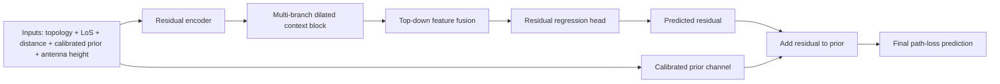

# Try 42: detailed sources and PMNet schema

## Main purpose of Try 42

`Try 42` is meant to answer a specific question:

- once a calibrated physical prior is already available, is a U-Net still the right backbone for learning the residual correction?

The answer is not assumed. This try exists to test that hypothesis explicitly.

## Why PMNet is the main inspiration

The strongest local-document source is:

- `TFG_Proto1/docs/markdown/2402.00878v1 (2)/2402.00878v1 (2).md`

That review highlights the following points:

1. plain U-Net / RadioUNet style models are limited when information must propagate over longer distances;
2. long-range propagation and reflected structure matter strongly in radio-map prediction;
3. PMNet uses:
   - a deeper residual encoder,
   - and several parallel dilated convolutions after the encoder.

This is exactly the type of inductive bias that makes sense once:

- the radial carrier structure is already partially explained by a prior,
- and the network mainly needs to learn structured corrections over larger spatial extents.

## Main sources behind Try 42

### PMNet and long-range radio-map context

1. Lee et al., **"PMNet: Robust Pathloss Map Prediction via Supervised Learning"** (arXiv, 2023)  
   Link: [https://arxiv.org/abs/2211.10527](https://arxiv.org/abs/2211.10527)

2. The local review in:
   - `TFG_Proto1/docs/markdown/2402.00878v1 (2)/2402.00878v1 (2).md`

### Earlier radio-map baselines used for comparison logic

3. Levie et al., **"RadioUNet"**  
   Link: [https://arxiv.org/abs/1911.09002](https://arxiv.org/abs/1911.09002)

4. Tian et al., **"RadioNet"**  
   Link: [https://arxiv.org/abs/2105.07158](https://arxiv.org/abs/2105.07158)

5. RMTransformer  
   Link: [https://arxiv.org/abs/2501.05190](https://arxiv.org/abs/2501.05190)

### Prior-residual formulation

6. Residual learning intuition for model-based prediction

7. The project’s own calibrated prior system:
   - `FORMULA_PRIOR_CALIBRATION_SYSTEM.md`
   - `TRY41_PRIOR_RESIDUAL_AND_REGIME_ANALYSIS.md`

## What Try 42 keeps

It keeps the strongest physically motivated part of the current system:

- the calibrated hybrid prior

which already includes:

- two-ray style LoS behavior,
- COST231-style attenuation tendency,
- train-only regime-aware quadratic calibration.

It also keeps:

- building-mask exclusion from training and evaluation,
- LoS input,
- distance map input,
- antenna-height channel.

## What Try 42 removes

It removes the parts that no longer seem like the right abstraction:

- adversarial training;
- discriminator logic;
- the old U-Net backbone;
- the assumption that path-loss should still be learned with an image-to-image generator-discriminator framing.

## PMNet-style schema used here

## More detailed architectural interpretation

The actual implementation in `Try 42` is PMNet-inspired rather than a strict reproduction.

It uses:

- a residual encoder with progressive downsampling;
- a context block with parallel dilated branches;
- feature fusion closer to a lightweight FPN than to a symmetric decoder;
- a final regression head predicting only the residual map.

This is intentionally more direct than the earlier family.

The goal is:

- not to generate a whole image from scratch,
- but to estimate the correction that the calibrated prior still misses.

## Why this architecture might be better than the old family

Because the project already learned that:

- the calibrated prior explains a large fraction of the easy structure;
- the missing part looks more like large-scale urban correction than like generic image translation;
- and the old U-Net family does not improve strongly enough beyond the prior.

So PMNet-style context aggregation may be a better fit than a symmetric U-Net decoder.

## How Try 42 could be improved later

Even if `Try 42` is the right direction, it is probably not the final form yet.

Promising next improvements would be:

1. stronger regime-aware residual weighting
   - give more emphasis to regimes where the prior is weakest

2. explicit prior-error conditioning
   - feed not only the calibrated prior, but also a confidence or expected-error proxy for the prior

3. city-held-out calibration and evaluation
   - to test whether the prior + residual system really transfers to unseen cities

4. richer PMNet-style context
   - larger dilation sets
   - or one additional context stage

5. residual target normalization by regime
   - because the residual scale may differ strongly by city type, LoS/NLoS, or antenna height

## Why the new regime metrics matter here

`Try 42` also adds richer validation metrics so that it is not judged only by one global RMSE.

It now reports:

- overall path-loss RMSE
- overall prior-only RMSE
- RMSE by `LoS` and `NLoS`
- RMSE by `city type`
- RMSE by `antenna-height bin`
- RMSE by the combined calibration regime

This is important because a better prior-residual model should ideally improve:

- not only the average score,
- but especially the regimes where the calibrated prior still fails most.
